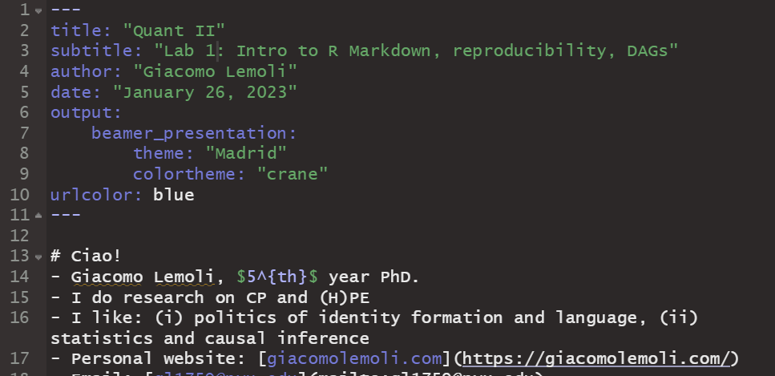
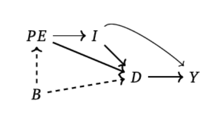
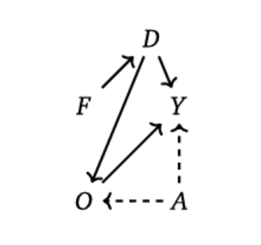
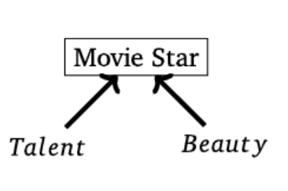

# Ciao!
> - Giacomo Lemoli, $5^{th}$ year PhD.
> - I do research on CP and (H)PE
> - I like: (i) politics of identity formation and language, (ii) statistics and causal inference
> - Email: [gl1759@nyu.edu](mailto:gl1759@nyu.edu)
> - Office: 404


# Logistics (1): recitations
> - Lab: Thursdays, 4pm - 6pm EST, Room 217
> - Lab materials will be posted on the lab's GitHub repo: [https://github.com/giacomolemoli/quant2-labs-spring-2023](https://github.com/giacomolemoli/quant2-labs-spring-2023)
> - For class material refer to [Course web page](https://cyrussamii.com/?page_id=3650)
> - Office hours: by appointment 

# Logistics (2): homeworks
> - Homework due via email to Cyrus and me by the [indicated deadline](https://cyrussamii.com/?page_id=3650)
> - Deadline is **strict**
> - Submit **PDF document** + **Code used**
>   - Markdown recommended (more below)
>   - Alternatively, PDF and separate R/Stata code
> - Code should be well commented (more below)
> - Tables and plots format should be of high quality, irrespective of the editor used
> - Substantive answers should be presented in the written paragraphs
> - Ultimately, the goal is to learn how to **do** and **communicate** empirical research


# Labs
> - Strong applied focus
> - Clarification on important concepts: examples, occasional additional derivations, simulations
> - Extensions
> - Applications: examples and replications from published papers' data
>   - Code samples and packages useful for homeworks
>   - Bridge theory (class) and practice (research papers)
> - Software: R (primary) and Stata (secondary)
>   - Focus on R, but Stata may be useful for homeworks, so resources will be available in both languages


# Today's plan
- R Markdown
- Doing reproducible work
- DAGs: conditioning, collider bias


# Install R
> - For MAC, go to [http://cran.r-project.org/bin/macosx/](http://cran.r-project.org/bin/macosx/)
> - For Windows, go to [http://cran.r-project.org/bin/windows/base/](http://cran.r-project.org/bin/windows/base/)
> - You should choose an editor and learn how it works
>   - One common choice is RStudio, but there is vim, emacs, Notepad++, etc.
> - If you are Python/Data science people, you can also download and run RStudio from Anaconda 


# When things break
> - Documentation - R: `?lm`. Stata: `help regress`
> - [Google](http://google.com)
> - CRAN (Reference manuals, vignettes, etc) - E.g.: [http://cran.r-project.org/web/packages/AER/index.html](http://cran.r> -project.org/web/packages/AER/index.html)
> - JSS - E.g.: [http://www.jstatsoft.org/v27/i02](http://www.jstatsoft.org/v27/i02)
> - Stack Overflow - [http://stackoverflow.com/questions/tagged/r](http://stackoverflow.com/questions/tagged/r)
> - Listservs - [http://www.r-project.org/mail.html](http://www.r-project.org/mail.html)

> - Stata - [https://www.statalist.org/](https://www.statalist.org/)


# Resources
> - [The Art of R Programming](http://heather.cs.ucdavis.edu/~matloff/132/NSPpart.pdf) - N. Matloff
> - [Modern Applied Statistics with S](http://www.stats.ox.ac.uk/pub/MASS4/) - W. Venables and B. Ripley
> - [Advanced R Programming](http://adv-r.had.co.nz/) - H. Wickham
> - [The R Inferno](http://www.burns-stat.com/documents/books/the-r-inferno/) - P. Burns
> - [Rdataviz](https://github.com/pablobarbera/Rdataviz) - a talk by P. Barberá on ggplot2
> - [Basic Intro to R](https://github.com/pablobarbera/NYU-AD-160J/tree/master/lab1) - also by P. Barberá
> - [Jamie Monogan](http://spia.uga.edu/faculty_pages/monogan/r.php)

# Resources
> - [Harvard Dataverse](https://dataverse.harvard.edu/) and other replication archives for scientific work
> - Reproduction/Replication is the best way to learn how to work with data and to code
> - If you are interested in using a technique, you should always look at the code and data of papers who use it
> - A search engine for replication data: [https://datasetsearch.research.google.com/](https://datasetsearch.research.google.com/)


# What is R Markdown?
> - A tool within RStudio that allows you to write documents, presentations, or webpages, and combine written text with code 
> - The text in the document can be fully formatted
> - You can choose whether to make your code visible or not
> - Output documents can be PDFs, Word Documents, HTML pages, and other formats


# Why R Markdown?
> - It has all the advantages of LaTeX for writing and formatting scientific documents
> - Directly embed code, code output, and text comments in one document
>   - All workflow (data analysis, graphs, tables, text) is in one place
> - Work is immediately reproducible and verifiable
> - Besides Quant 2 homeworks, I recommend to use it for all class projects that involve replications or data analyses


# What if I prefer Stata?
> - You can still use Markdown via [Stata Markdown](https://data.princeton.edu/stata/markdown/) 
>   - Similar to R Markdown, you can write from your Stata editor
> - Up-to-date Stata software is available on NYU desk machines


# Getting started with R Markdown
> - You need to download R and RStudio. For recent versions, that's enough
> - You may need to install some packages the first time (`knitr`,`markdown`)
> - If you want to generate PDF output, you also need a LaTex system (e.g. [MiKTeX](https://miktex.org/download))


# Getting started with R Markdown
Once you have done all that, 

1. Open RStudio
2. Select File > New File > R Markdown
3. Enter Title, Author, Output Format (which can easily be changed later)
4. You are good to go! You will see that there is some example text that you can delete. 


## Markdown document
The documents typically have four different pieces: the **YAML**, the **formatted text**, **code chunks**, and **inline code**. 


# YAML
> - At the beginning of any R Markdown script is a YAML header section enclosed by ---.
> - Includes title, author, date, and type of document you want to produce
>   -`beamer_presentation`, `pdf_document`, `html_document`, etc
>   - An overview of the available output formats is [here](https://rmarkdown.rstudio.com/lesson-9.html)
> - **NB**: rules in the header section will alter the whole document

# YAML
You will always insert something like this at the top of your new .Rmd script:

```
---
title: "Quant II"
subtitle: "Lab 1: Introduction: R Markdown, reproducibility, DAGs"
author: "Giacomo Lemoli"
date: "January 26, 2023"
---
```

# Code chunks
- The real payoff of R Markdown
- The code you enter is executed and the results are displayed in the document
- Syntax for code chunks:

```
'''{r}
R code here
'''
```

# Code chunks
- Note that ``` are backticks, not quotes or apostrophes. Everything that goes between these backticks should have R syntax

\tiny
```{r}
set.seed(1)

x <- runif(10)
y <- rnorm(10, x, 1)
df <- data.frame(x, y)
df
```

# Code chunk options
- You can specify options for each code chunk

```
' ' ' {r name, echo = TRUE, eval=TRUE, warning=FALSE, message=FALSE}  
R code here
' ' '
```

> - name - A label for your code chunk
> - echo - Whether to display the code chunk or just show the results. If you don't want the reader of the document to see the code, but just the output, set echo=FALSE
> - eval - Whether to run the code in the code chunk
> - warning - Whether to display warning messages in the document
> - message - Whether to display code messages in the document

# Output visualization
\tiny
```{r}
iris <- read.csv("iris.csv", sep = ",")

head(iris)
```

# Output visualization
\tiny
```{r}
fit <- lm(Sepal.Length ~ Sepal.Width, iris)

summary(fit)

```

# Output visualization
\tiny
```{r, message=FALSE}
library(stargazer)

stargazer(fit, type = "text")

```

# Output visualization
\tiny
```{r fig, fig.height = 3, fig.width = 3, fig.align = "center"}
plot(iris$Sepal.Width, iris$Sepal.Length)
```


# Output visualization
```

```


# Formatted text
It is very easy to format your text in Markdown. 

-  `*italics*` *italics*
-  `**bold**` **bold**
- `~~strikethrough~~`  ~~strikethrough~~
- `[nyu](https://www.nyu.edu/)` [nyu](https://www.nyu.edu/)
- `superscript^2^` superscript^2^

You can find many more (e.g. headers, lists, etc.) [here](https://www.rstudio.com/wp-content/uploads/2015/02/rmarkdown-cheatsheet.pdf) or Googling

# Equations
- Use LaTex notation

- Inline equation (single dollar sign)
We can use inline equations such as `$y_i = \alpha + \beta x_i + e_i$` which is displayed as $y_i = \alpha + \beta x_i + e_i$ .

- Displayed equation (double dollar sign)
```
$$f(x) = \frac{e^{(-x-\mu)^{2}/(2\sigma^{2})}}
{\sigma \sqrt{2\pi}}$$
```
Which give this:
$$
f(x) =  \frac{e^{(-x-\mu)^{2}/(2\sigma^{2})}}{\sigma \sqrt{2\pi}} 
$$

# Equations

For multiline equations, you need the `aligned` environment:

```
$$
\begin{aligned}
x & = 2*z + 3 \\
y & = 5*z + 6
\end{aligned}
$$
```

$$
\begin{aligned}
x & = 2*z + 3 \\
y & = 5*z + 6
\end{aligned}
$$


# Inline code
- You can embed R output within text
- Use [r R-object] within the single backticks 


```{r}
mean <- mean(x)
```

The mean of x is bt-r mean-bt

The mean of x is `r mean`

- Text gets updated automatically when code is updated too

# Reproducibility
> - One of our learning objectives in this class (and in other classes)
> - The importance of preserving reproducibility while working cannot be stressed enough
> - It should be as easy as possible to reproduce all the steps that go from data to results
>   - First and foremost for us and co-authors/collaborators, then for everyone else
> - Implications: structure of data files and folders, coding style 

# Files/folders
> - Files should be set-up and organized in a coherent way
>   - E.g. not keeping everything in the Desktop folder
> - Unique directory for the class
> - Inside it, new directory for each new project
> - Within the project: use sub-directories
>   - E.g. "Raw data" folder to store data, "Codes" folder for the scripts, "Output" folder for saving the results
> - From inside the script you can use the project folder as main directory
>   - R: `setwd("path_to_project_dir")`. Stata: `cd "path_to_project_dir"` 
> - Then your code pulls files from and saves files to the specific sub-directories

# Code
> - Coding style is like writing style: as personal as it can be, but should follow guidelines
>   - Key principles are efficiency, clarity and transparency (mostly for ourselves and co-authors/collaborators)
> - Code script should be concise and as short as possible
> - Exhaustive and constant in-line comments
>   - Every line (or sequence of lines that performs a self-contained task) should be preceded by a comment explaining what it does
> - Avoid redundancy
>   - If the same action is needed multiple times, better to write a callable function for it, or use loops 
>   - Copy-and-paste of code chunks makes errors more likely and is hard to read through
> - Play around with replication packages to learn coding tricks


# Resources
- Great resource: [Gentzkow and Shapiro (2014), Code and Data for the Social Sciences: a Practitioner's Guide](http://web.stanford.edu/~gentzkow/research/CodeAndData.pdf)


# DAGs
> - Represent causal mechanisms, i.e. causal relationship between different variables
> - Important concepts:
>   - Backdoor path: non-causal dependency between D and Y
>   - Collider: variable caused by different variables

# Conditioning in DAGs
Conditioning on some variable $w$ in a DAG is equivalent to do the following steps:

> - If $w$ is a collider, link all pairs of parents of $w$ by drawing an undirected edge between them
> - For any ancestor of $w$, if this ancestor is itself a collider, link all pairs of parents of this ancestor with undirected edges to connote induced dependencies
> - Erase $w$ from the graph and all the edges connected with $w$


# DAGs
An example from the Mixtape



# Collider bias
- Let's see these properties at work, with some simulations
- Examples and code from The Mixtape, (pp. 108-113)

Case 1: the effect of gender discrimination on women income


# Collider bias
\tiny
```{r, message=F, warning=F}
library(tidyverse)
library(stargazer)

# Set seed
set.seed(123)

# Simulate our data
tb <- tibble(
  female = ifelse(runif(10000) >= 0.5, 1, 0),
  ability = rnorm(10000),
  discrimination = female,
  occupation = 1 + 2*ability + 0*female - 2*discrimination + rnorm(10000),
  wage = 1-1*discrimination + 1*occupation + 2*ability + rnorm(10000)
)

# Estimate regressions 
lm_1 <- lm(wage ~ female, tb)
lm_2 <- lm(wage ~ female + occupation, tb)
lm_3 <- lm(wage ~ female + occupation + ability, tb)

```

# Collider bias
\tiny
```{r}
# Compare
stargazer(lm_1, lm_2, lm_3, type = "text",
          column.labels = c("Biased unconditional",
                            "Biased",
                            "Unbiased Conditional"))

```


# Collider bias
Case 2: Talent and beauty



# DAG simulations

\tiny
```{r}
library(tidyverse)

# Set seed 
set.seed(3444)

# Simulate data
star_is_born <- tibble(
  beauty = rnorm(2500),
  talent = rnorm(2500),
  score = beauty + talent,
  c85 = quantile(score, .85),
  star = ifelse(score >= c85, 1, 0)
)

```


# DAG simulations

\tiny
```{r, fig.height = 2.7, fig.width = 4}
star_is_born %>% 
  lm(beauty ~ talent, .) %>%
  ggplot(aes(x = talent, y = beauty)) +
  geom_point(size = 0.5, shape = 23) + xlim(-4, 4) + ylim(-4, 4) +
  theme_bw()
  
```

# DAG simulations

\tiny
```{r, fig.height = 2.7, fig.width = 4}

star_is_born %>% 
  filter(star == 1) %>% lm(beauty ~ talent, .) %>%
  ggplot(aes(x = talent, y = beauty)) +
  geom_point(size = 0.5, shape = 23) + xlim(-4, 4) + ylim(-4, 4) +
  theme_bw()
  
```

# Conclusion
- Don't control for/condition on colliders
  - Endogenous sample selection is a form of collider bias
  - See discussion in Knox et al (2020) on admin data

Additional resources:

- [Elwert and Winship (2014), Endogenous selection bias: the problem of conditioning on a collider variable](https://www.annualreviews.org/doi/pdf/10.1146/annurev-soc-071913-043455)
- [Knox, Lucas, and Cho (2022), Testing causal theories with learned proxies](https://dcknox.github.io/files/KnoxLucasCho_CausalTheoriesLearnedProxies.pdf)
- [Schneider (2020), Collider bias in economic history research](https://www.sciencedirect.com/science/article/abs/pii/S0014498320300516)

