```{r setup, include=FALSE}
knitr::opts_chunk$set(echo = TRUE, eval=TRUE, warning=FALSE, message=FALSE)
```

# Today's plan

- Fuzzy RDD

- Multiple cutoffs and GRDD

- RDD and heterogeneity: Diff-in-disc

- Local randomization approach

- RDD for the effect of politician characteristics (PCRDD)


# Fuzzy RDD

Endogenous treatment take-up or non-compliance, but discontinuous change in treatment probability.

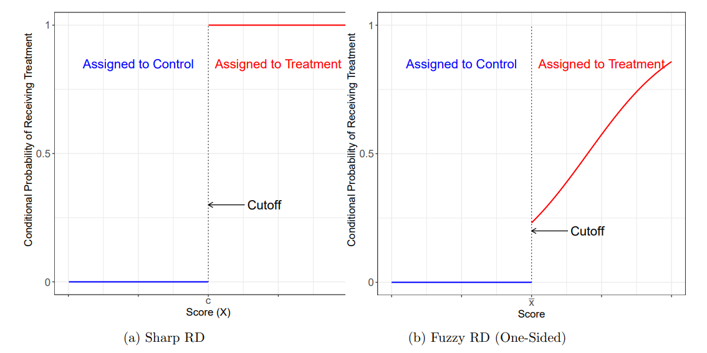

# Fuzzy RDD

> - IV model where the treatment $D$ is endogenous and the cutoff rule gives the instrument. Under the usual IV assumptions:

$$\frac{\lim_{x \to c^+} E[Y_i|X=x] - \lim_{x \to c^-} E[Y_i|X=x]}{\lim_{x \to c^+} E[D_i|X=x] - \lim_{x \to c^-} E[D_i|X=x]} = \tau_{FRD}$$

> - Under heterogeneous TE and motonicity, $\tau_{FRD}$ has a LATE interpretation.

> - Estimation: once IV regression, today argument `fuzzy` in `rdrobust`


# Multi-score RDD

> - Treatment assignment depends on more than one RV
>   - School admission based on multiple test scores
>   - Policy eligibility based on more than one criteria
>   - Treatment based on being on a side of a boundary


# Multi-score RDD
Differences relative to standard RDD:

> - Continuity along both dimensions

> - Effect at every boundary point: a *treatment effect curve*

> - One could estimate the effect at different points of the boundary to characterize heterogeneity

# GRDD

> - Effect of geographic boundaries: a long interest of political science

> - Political/administrative boundaries

> - Media market boundaries


# GRDD
[Velez and Newman (2018)](https://onlinelibrary.wiley.com/doi/full/10.1111/ajps.12427)

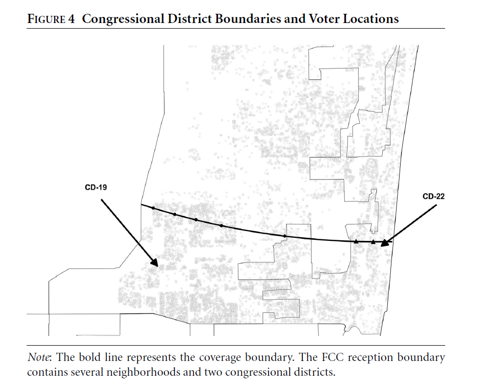{width=70%}

# GRDD
[Dell (2010)](https://scholar.harvard.edu/files/dell/files/ecta8121_0.pdf)

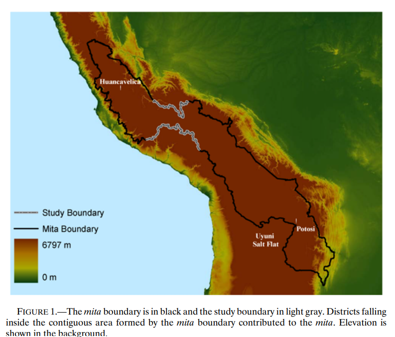{width=70%}

# GRDD
[Müller-Crepon (2021)](http://www.carlmueller-crepon.org/publication/admin_identities/CMC_BuildingTribes.pdf)

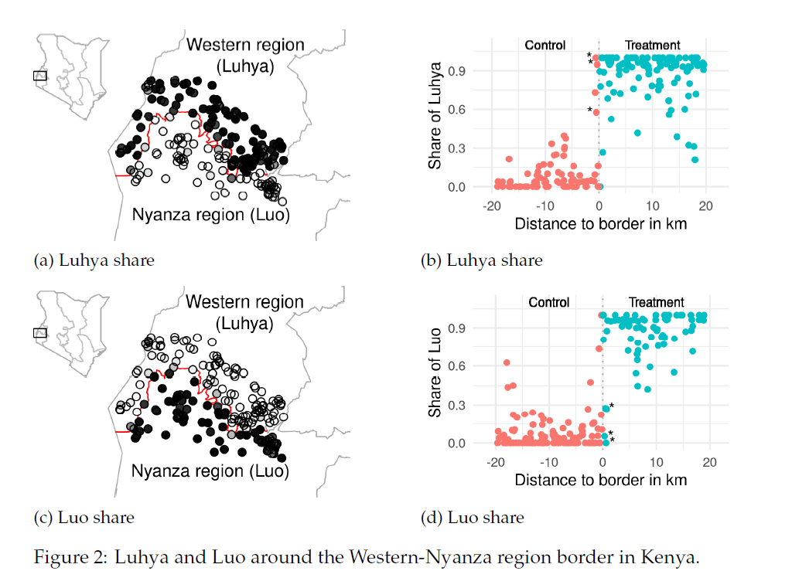{height=85%}


# GRDD
[Rozenas, Schutte, and Zhukov (2017)](https://www.journals.uchicago.edu/doi/abs/10.1086/692964)
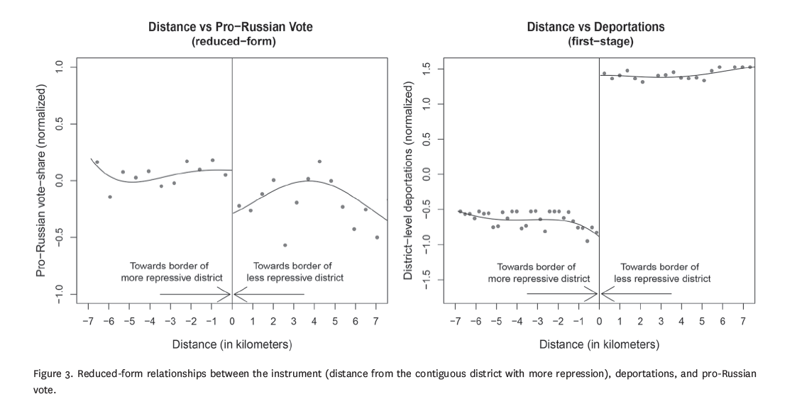

# GRDD

Discussion in [Keele and Titiunik (2015)](https://www.cambridge.org/core/services/aop-cambridge-core/content/view/2A59F3077F49AD2B908B531F6E458430/S1047198700011645a.pdf/div-class-title-geographic-boundaries-as-regression-discontinuities-div.pdf)

Challenges:

> - Compound treatments: many things change at the same boundary

> - Geographic sorting

> - Sparsity around the boundary

> - Non-exogeneity of the boundary


# Non-exogeneity of the boundary
[Ferwerda and Miller (2014)](https://www.cambridge.org/core/services/aop-cambridge-core/content/view/D6683A3560C162165826E33CEA72B95D/S0003055414000240a.pdf/div-class-title-political-devolution-and-resistance-to-foreign-rule-a-natural-experiment-div.pdf)

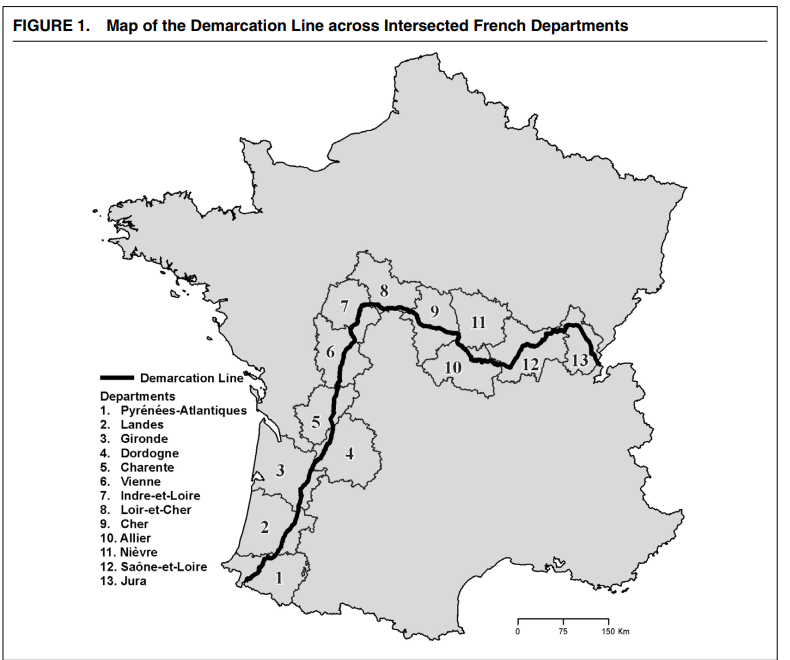{height=80%}

# Non-exogeneity of the boundary
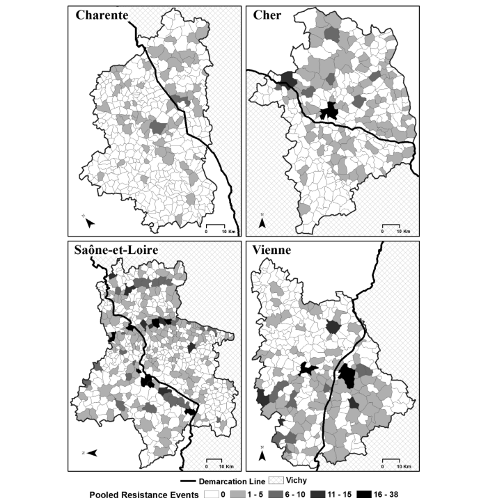{height=90%}

# Non-exogeneity of the boundary
[Kocher and Monteiro (2016)](https://www.cambridge.org/core/services/aop-cambridge-core/content/view/49EBB15B1B8F1E4A3B4441D46725CBED/S1537592716002863a.pdf/lines_of_demarcation_causation_designbased_inference_and_historical_research.pdf) \pause

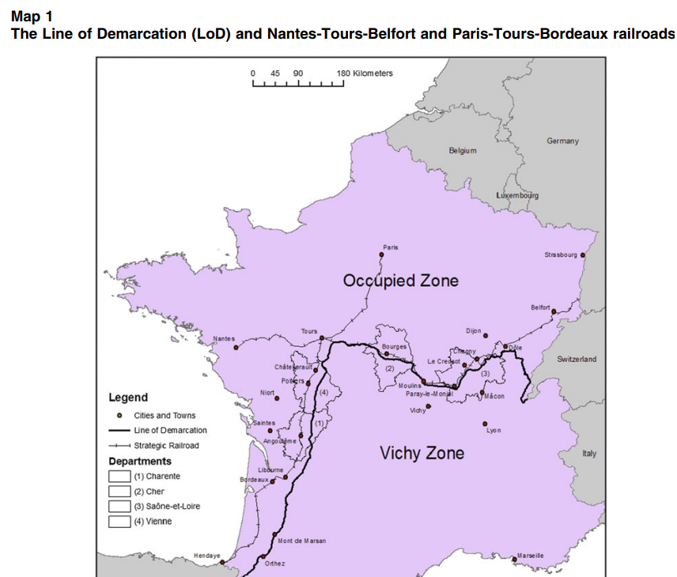{height=75%}

# Non-exogeneity of the boundary
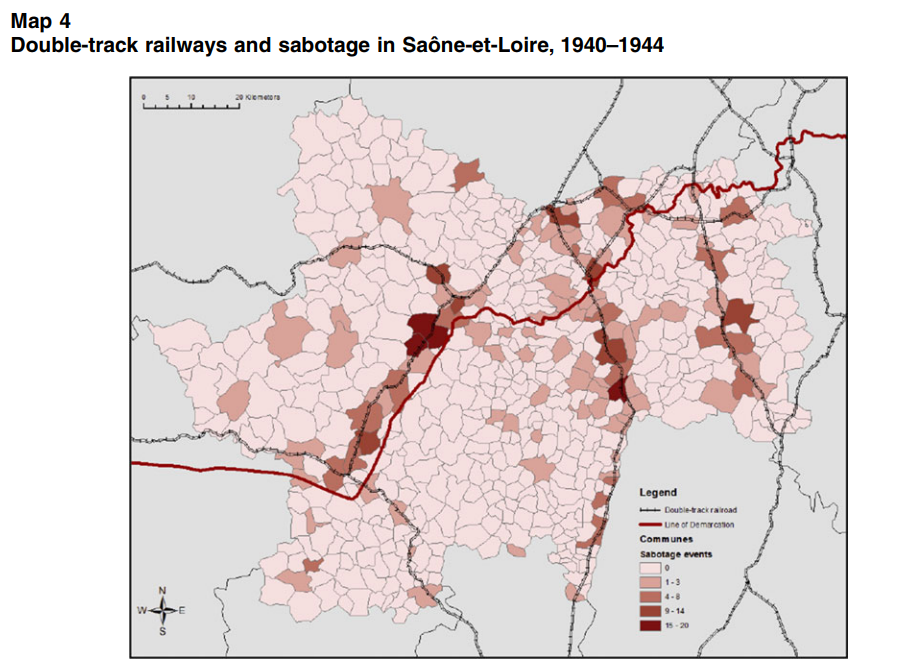{height=90%}

# GRDD

Example


# Difference-in-discontinuities

> - Add a dimension of heterogeneity (e.g. time) to RDD

> - Addresses problems of compound treatment if one of the treatments is introduced *after* the other

> - Estimate moderation effects
>   - Assumptions not very formalized

> - Usually standard regression models within a bandwidth, more parametric assumptions

# Difference-in-discontinuities
[Grembi, Nannicini, and Troiano (2016)](https://www.jstor.org/stable/pdf/24739127.pdf?casa_token=K_64pn0NlVkAAAAA:By9zpo_974A8ONzhHTvFW9oiEeDwuPY4rI7VIhyP2IXFZ0sufr1-82IOCggjN2mZAf54srViLNvqPH9onb8vwM0rMDDFADy_dAlK5CVHrHQOC7GHFqU)

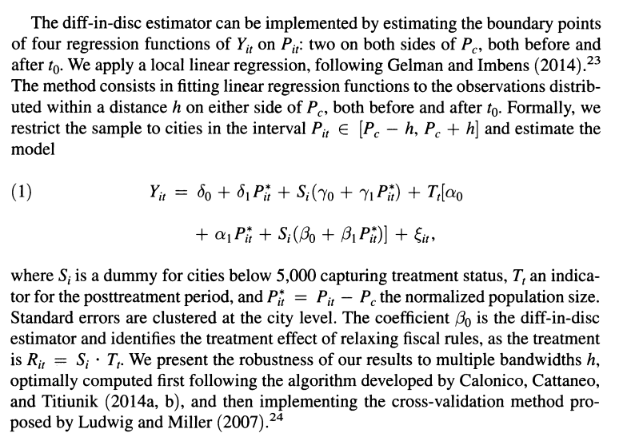{height=80%}

# Difference-in-discontinuities
[Larreguy, Marshall, and Querubín (2016)](https://www.cambridge.org/core/services/aop-cambridge-core/content/view/48C2C56999E4C50F47D3EBC920208E45/S0003055415000593a.pdf/parties-brokers-and-voter-mobilization-how-turnout-buying-depends-upon-the-party-s-capacity-to-monitor-brokers.pdf)

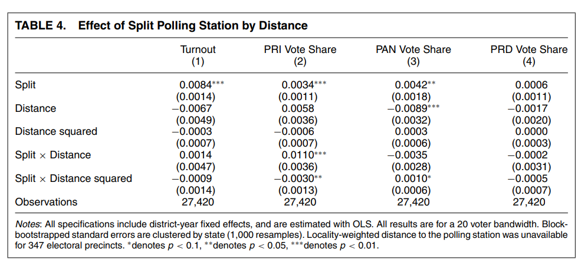

# Local randomization

> - Alternative approach to RDD

> - Instead of continuity, assume random assignment in a neighborhood of the cutoff \pause

Given a window $W_0$ around the cutoff:

> - Distribution of RV in $W_0$ is known, the same for all units, and does not depend on the potential outcomes: $F_{X_i|X_i \in W_0}(x) = F(x)$

> - Inside $W_0$, the potential outcomes depend on the running variable solely through the treatment indicator $T_i = \mathbb{I}(X_i > c)$, but not directly: $Y_i(X_i, T_i) = Y_i(T_i) \forall i \text{s.t.} X_i \in W_0$ 

> - **More** restrictive than continuity, but finite sample inference methods


# Local randomization
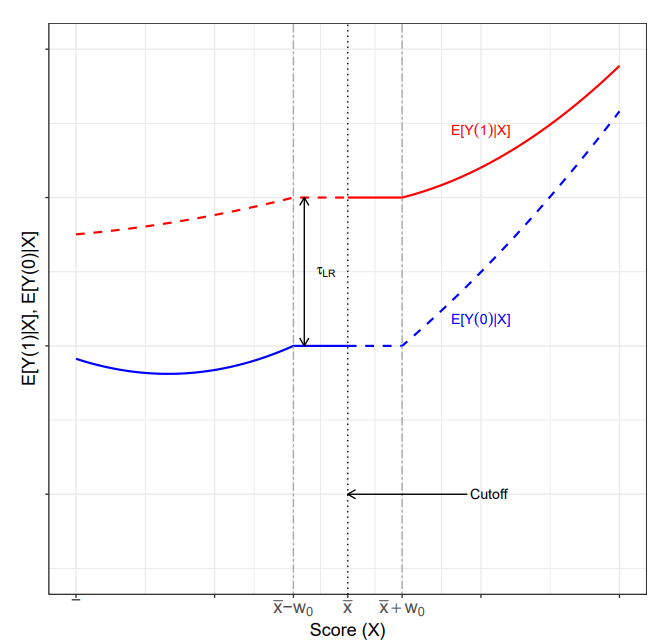{height=85%}

# Local randomization

> - Estimation and inference with the package `rdlocrand`

> - Data-driven approach to find the window: specify pre-determined covariates, choose larger windows until T and C units are no longer balanced on them

> - Fisherian methods for inference: randomization inference for the sharp null

# Estimation

To choose the window, specify: 

> - Covariates to use for balance

> - Test statistic to use for balance (e.g. difference in means)

> - Randomization mechanism

> - Minimum no. observations in the smallest window

> - Significance level

> - Then, difference-in-means within the selected window + randomization inference

# Application to Islamic mayors


\tiny
```{r, eval=F}
library(rdlocrand)
Z <- cbind(data$i89, data$vshr_islam1994, data$partycount, data$lpop1994,
           data$merkezi, data$merkezp, data$subbuyuk, data$buyuk)
colnames(Z) = c("i89 ", "vshr_islam1994", "partycount", "lpop1994",
                "merkezi", "merkezp", "subbuyuk", "buyuk")
```


# Application to Islamic mayors
\tiny
```{r, eval=F}
out <- rdrandinf(Y, X, covariates = Z, seed = 50, d = 3.019522)
```

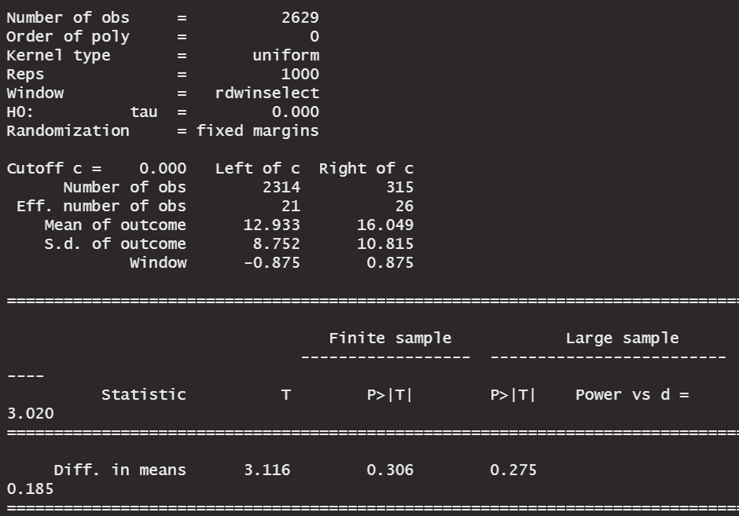{height=80%}


# PCRDD

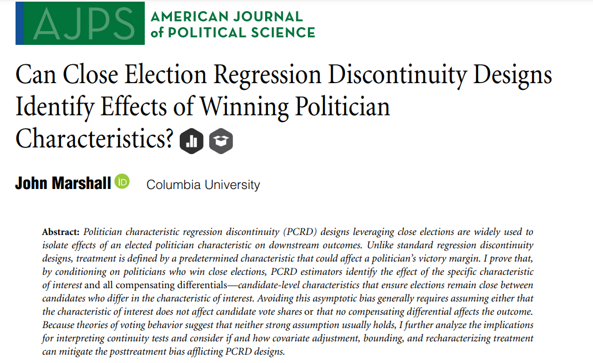
