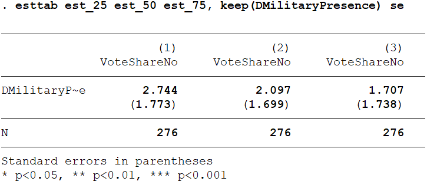
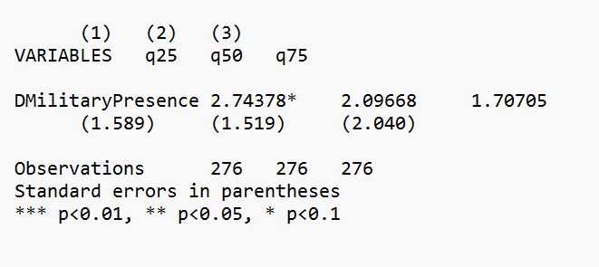
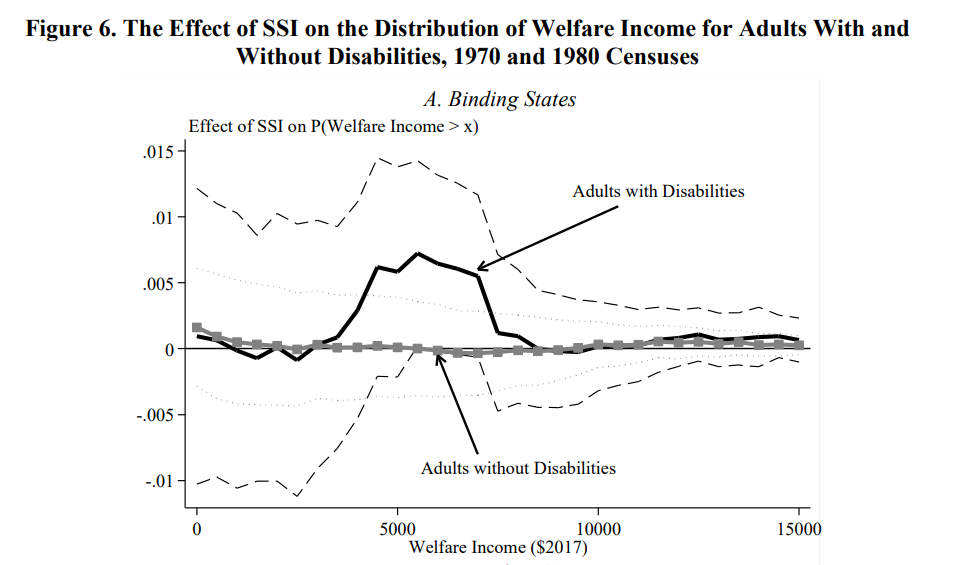

```{r setup, include=FALSE}
knitr::opts_chunk$set(echo = TRUE, eval=TRUE, warning=FALSE, message=FALSE)
```


# Housekeeping

- Homework 4 tips

# Today's plan

- Distributional effects (material from last year's lectures)

- Quantile regression

- Distribution regression

- Application


# Motivation

> - So far: focused on average causal effects

> - Other objects of interest: effects for other features of the potential outcome distributions

> - Examples: inequality in the wage distribution, changes in electoral outcomes

# Concepts review

> - CDF: $F_Y(y) = Pr(Y\leq y) = \mathbb{E}[\mathbb{I}(Y \leq y)]$

> - Quantile function: $Q_{\tau}(Y) = \mathbb{F}^{-1}_Y(\tau) = \text{inf}\{y:F_Y(y) \geq \tau\}$

> - Quantile at $\tau$ = value of $Y$ such that $\tau$ of observations are less than $Y$

> - If $\tau$=0.9: 9$^{th}$ decile or 90% percentile 


# Quantile regression

- Our focus so far: CEF $$E[Y_i \mid X_i]=\int_{y} ydF_{Y\mid X}(y \mid X_i)$$ \pause

- Minimizes MSE of the prediction:

$$E[Y_i \mid X_i]= \text{arg} \min_{m(X_i)} E[(Y_i - m(X_i))^2]=$$ 

\pause

> - OLS estimator is the solution in the sample analogue when we use a linear specification $m(X_i)=X_i'\beta$

$$\hat{\beta}_{OLS}=\text{arg} \min_{\beta} \frac{1}{N}\sum_{i=1}^{N}(Y_i - X_i'\beta)^2$$

# Quantile regression

- Replace CEF with CQF (conditional quantile function)
 for $\tau$: $Q_{\tau}(Y_i \mid X_i) = \mathbb{F}_{Y|X}^{-1} (\tau \mid X_i)$ \pause
 
- Solves another minimization problem

$$ 
\begin{aligned}
Q_{\tau}(Y_i \mid X_i) = \text{arg} \min_{q(X_i)} \mathbb{E}[\rho_\tau (Y_i - q(X_i))] \\
\rho_\tau(u) = u(\tau - \mathbb{I}(u \leq 0))
\end{aligned}
$$

# Quantile regression

- Sample analogue with linear specification for $q(X_i)$:

$$
\hat{\beta}_{\tau} = \text{arg} \min_{\beta_{\tau}} \frac{1}{N} \sum_{i=1}^{N} \rho_{\tau}(Y_i - X_i'\beta_{\tau})
$$
\pause 

- $\hat{\beta}_{\tau}$ generally asymptotically normal

- Bootstrap to compute SE and confidence intervals


# Quantile regression

> - Interpretation: QR coefficient estimates a change in the quantile of the outcome distribution

> - Not for units whose outcome lies at the quantile

> - Angrist and Pischke (p. 281): positive effect on lowest decile of wage distribution means that "the poors" are less poor than in the counterfactual; not that someone poor is now less poor

> - Another useful application: censored data
>   - E.g. effects at 90$^{th}$ percentile identifiable even if top 5% of data are censored


# Quantile regression: implementation

> - Stata: `qreg` and sister commands
>   - `sqreg` and `bsqreg` for bootstrapped standard errors

> - R: `quantreg`
>   - Several methods available, different SEs through `summary`


# Working example

The effect of military repression on support for democracy: the Chilean 1988 plebiscite

{width=75%}


# Quantile regression in Stata
Estimation with `qreg`



# Quantile regression in Stata
Bootstrapping option




# Quantile regression in R
\tiny
```{r}
library(quantreg); library(haven); library(dplyr); library(ggplot2)

# Import data
d <- read_dta("FinalDatasetForReplication.dta") 

# Prepare
d <- d %>% filter(MainSample == 1)

# Quantile regression
set.seed(10)
mod <- rq(VoteShareNo ~ DMilitaryPresence + share_allende70 + share_alessandri70 +
            lnDistStgo + lnDistRegCapital + Pop70_pthousands + sh_rural_70 + factor(IDProv),
          tau = c(0.25, 0.5, 0.75), data = d)

# Results (bootstrap SE)
est <- summary(mod, se = "boot")
out <- do.call("rbind", lapply(est, function(x) c(x$tau,
                                 x$coefficients["DMilitaryPresence",])))
out


```


# Distribution regression

> - Alternative approach to distributional effects

> - Instead of estimating changes in quantiles ("x-axis"), we estimate changes in density ("y-axis")

> - CDF: $F(y \mid x) = Pr(Y \leq y) \mid X=x) = \mathbb{E}[\mathbb{I}(Y \leq y)\mid X=x]$

> - Model $\mathbb{E}[\mathbb{I}(Y \leq y)\mid X=x]$ at selected values of $y$


# Implementation

> - Create dummies for being below/above some value in the outcome distribution

> - For interpretability reasons use the inverse of the CDF $1 - F(y)=\mathbb{I}[y_i \geq y]$

> - Use dummies as outcomes in separate regressions

> - OLS coefficient: treatment effect on the share of units in that support region 

> - With continuous treatment one can also use logit or probit


# Distribution regression
Characterize the changes in the distribution. From [Goodman-Bacon and Schmidt (2020)](http://goodman-bacon.com/pdfs/gbs_ssi.pdf):

{width="75%"}
\pause 


# Application: Chilean referendum

First visualization: PDF
\tiny
```{r, fig.align="center", fig.height=5}
ggplot(d, aes(x=VoteShareNo,  group=DMilitaryPresence, fill=factor(DMilitaryPresence))) + 
  geom_density(alpha=0.5) + 
  scale_fill_manual(values = c("grey", "blue"), name = "Military Presence", labels=c("No", "Yes")) +
  labs(x="% No") + theme_bw()
```

# Application 

Another visualization: CDF

\tiny
```{r, fig.align="center", fig.height=5}
ggplot(d, aes(x=VoteShareNo, group=DMilitaryPresence, color=factor(DMilitaryPresence))) +
  stat_ecdf() + scale_color_manual(values = c("grey", "blue"), name = "Military Presence", labels=c("No", "Yes")) +
  labs(x="% No", y="Empirical CDF") + theme_bw()
```

# Distribution regression

\tiny
```{r}
distr_reg <- function(i) {
  library(fixest); library(dplyr)
  d <- d %>% mutate(dum = case_when(VoteShareNo >= i ~ 1,
                                    VoteShareNo < i  ~ 0))
  fit <- feols(dum ~ DMilitaryPresence + share_allende70 + share_alessandri70 +
                   lnDistStgo + lnDistRegCapital + Pop70_pthousands + 
                   sh_rural_70 | IDProv, data = d, weights = ~Pop70, vcov = "hetero")
  coef <- coefficients(fit)["DMilitaryPresence"]
  ll <- confint(fit)["DMilitaryPresence", "2.5 %"]
  ul <- confint(fit)["DMilitaryPresence", "97.5 %"]
  
  cbind(i, coef, ll, ul)
}

out <- as.data.frame(do.call("rbind", lapply(as.list(seq(10, 70, 10)),
                                             function(x) distr_reg(x)))) 
```
 
 
# Distribution regression
\tiny
```{r, fig.align="center", fig.width=9, fig.height=4}
ggplot(out, aes(x=i, y = coef)) + geom_point() + geom_line() +
  geom_line(aes(x=i, y=ll), colour = "blue", linetype="dashed") +
  geom_line(aes(x=i, y=ul), colour = "blue", linetype="dashed") +
  geom_hline(yintercept=0, col="red", linetype = "dotted") +
  scale_x_continuous(breaks = seq(10,70,10)) + labs(x="% No", y="Effect") + theme_bw()
```


