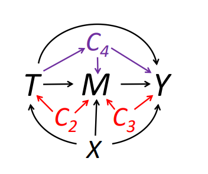
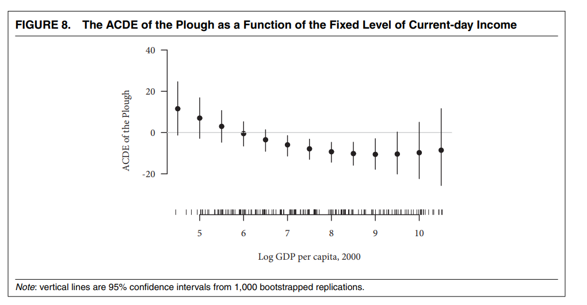
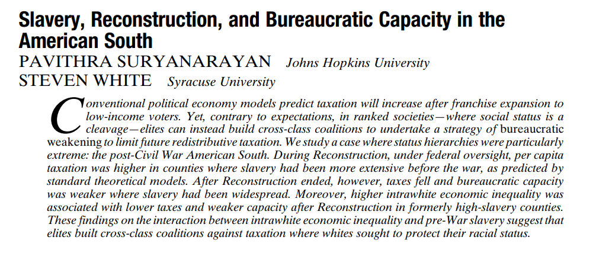
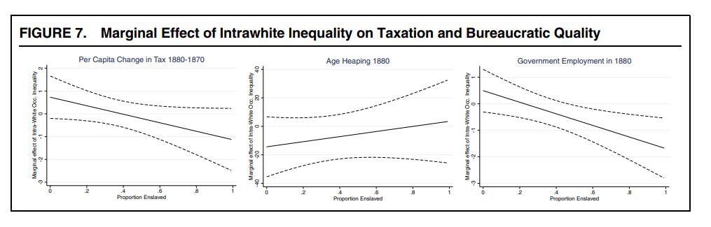

```{r setup, include=FALSE}
knitr::opts_chunk$set(echo = TRUE, eval=TRUE, warning=FALSE, message=FALSE)
```

# Today's plan

- Mediation

- Moderation


# Mediation: concepts review

> - Total Effect: $\tau_i = Yi(1,Mi(1)) - Yi(0,Mi(0))$

> - Natural Direct Effect: $\zeta_i(t) = Y_i(1, M_i(t)) - Y_i(0, M_i(t))$

> - Natural Mediation Effect: $\delta_i(t) = Y_i(t, M_i(1)) - Y_i(t, M_i(0))$

> - $\tau_i = \delta_i(t) + \zeta_i(1-t)$

> - ID assumption for $\delta$ and $\zeta$: sequential ignorability


# Sequential ignorability

$$
\begin{aligned}
T_i \perp (Yi(t',m), M_i(t))|X_i=x \\
M_i(t) \perp Y_i(t', m)|T_i, X_i=x
\end{aligned}
$$

> - First part: CIA, satisfied in a randomized experiment

> - Second part: no omitted post-treatment confounder or other mediator causally connected to $M$


# Sequential ignorability
{align=center}


# Causal mediation analysis

> - R package `mediation`: causal mediation analysis under sequential ignorability

> - Identify effect of $T$ on $M$ given $X$ and the effect of $M$ on $Y$ given $T$ and $X$

> - With them compute the direct/mediation effects

> - In the special case of linear models one can multiply the coefficients

# Causal mediation analysis

- Working example from the `mediation` package: Brader et al (2008)

- $T$: Media stories about immigration
- $Y$: Letter about immigration policy to representative in Congress
- $M$: Anxiety
- $X$: Age, education, gender, income


# Casual mediation analysis
\tiny
```{r}
library(mediation)

data(framing)

set.seed(2014)

# Model for the mediator (T + X)
med.fit <- lm(emo ~ treat + age + educ + gender + income, data = framing)

# Model for the outcome (M + T + X)
out.fit <- glm(cong_mesg ~ emo + treat + age + educ + gender + income, data = framing, 
               family = binomial("probit"))

# Compute the mediation effects
med.out <- mediate(med.fit, out.fit, treat = "treat", mediator = "emo", 
                   robustSE = TRUE, sims = 100)
```


# Causal mediation analysis
\tiny
```{r}
summary(med.out)
```


# Controlled Direct Effect

> - Controlled Direct Effect: $\kappa_i(m) = Y_i(1,m) - Y_i(0,m)$

> - Effect of $T$ on $Y$ when $M$ has the same value for all units.

> - Relative to NDE and NME, identified also in presence of intermediate confounders

> - A natural approach to close $M$ channel: include $M$ as control in the regression

> - In presence of intermediate confounders, this introduces post-treatment bias

> - CDE is an estimand that allows to overcome this issue


# Sequential g-estimation

> - Popularized in political science by [Acharya, Blackwell, and Sen (2016)](https://www.mattblackwell.org/files/papers/direct-effects.pdf)

> - Procedure in two stages:

> - Regress $Y$ on $M$, $T$, pre-treatment and intermediate variables

> - Subtract from $Y$ the effect of $M$: get the "demediated" $Y$, $\tilde{Y} = Y - \hat{\beta_M}M$

> - Regress $\tilde{Y}$ on $T$ and pre-treatment variables

> - Doing it by hand would ignore variability in $\tilde{Y}$, which is an estimated quantity, resulting in wrong SEs

> - Use the package `DirectEffect` or bootstrap

> - Center the mediator at the value you want to "fix" it at


# Sequential g-estimation

> - Why is it important?

> - Research questions may involve comparisons that "hold fixed" things realized after the treatment

> - Do natural shocks impact political development even in absence of physical destruction?

> - Does ethnic diversity lead to conflict even in absence of government instability?

> - We may also want to rule causal mechanisms alternative to our theory
>   - Are the effects of slavery/famine just due to subsequent changes in racial/ethnic composition? (Acharya, Blackwell, and Sen (2016); Rozenas and Zhukov (2019) resp.)


# Application

- [Alesina, Giuliano, and Nunn (2013)](https://scholar.harvard.edu/files/nunn/files/alesina_giuliano_nunn_qje_2013.pdf): data provided with the `DirectEffects` package

- $Y$: share of political positions held by women in 2000
- $T_i$: relative proportion of ethnic groups that traditionally used the plow within a country
- $M_i$: log GDP per capita in 2000, mean-centered
- $Z_i$: post-treatment, pre-mediator intermediate confounders
  - civil conflict, interstate conflict, oil, European descent, communist, polity2..)
- $X_i$: pre-treatment characteristics of the country
  - tropical climate, agricultural suitability, large animals, political hierarchies, economic complexity, rugged


# Application
\tiny
```{r}
library(DirectEffects)

data("ploughs")

## ATE
ate_mod <- lm(women_politics ~ plow + agricultural_suitability + tropical_climate +
                large_animals + political_hierarchies + economic_complexity + rugged, 
              data = ploughs)

summary(ate_mod)[[4]]["plow",]

```

# Application
\tiny
```{r}
## Formula for sequential_g
form_main <- women_politics ~ plow + agricultural_suitability + tropical_climate +
  large_animals + political_hierarchies + economic_complexity + rugged | # pre-treatment vars
  years_civil_conflict + years_interstate_conflict  + oil_pc + european_descent +
  communist_dummy + polity2_2000 + serv_va_gdp2000 | # intermediate vars
  centered_ln_inc + centered_ln_incsq # mediating vars

## Sequential g-estimation
direct <- sequential_g(formula = form_main, data = ploughs)

```


# Application
\tiny
```{r}
summary(direct)
```


# More on DirectEffects

> - Sensitivity analysis using `cdesens` function

> - Can center mediator at different values to see how CDE varies at different values of $M$ \pause




# Moderation

> - Characterize treatment effect heterogeneity

> - Why is it important?

> - Knowledge: going beyond the aggregation

> - Policy: on what sub-populations the intervention is more effective

> - Mechanisms: understanding what units drive the average effect gives insights about what the treatment is doing

> - Methodologically: regression-based methods vs non-parametric methods


# Moderation in regression

- Classical approach: interaction terms. Let's start from the case of binary treatment $D_i$ and binary moderator $Z_i$. \pause

$$
y_i = \alpha + {\color{red}\beta} D_i + \gamma Z_i + {\color{blue}\delta} D_i*Z_i + \epsilon_i
$$

> - ${\color{red}\beta}$: effect of $D_i$ when $Z_i = 0$

> - $\gamma$: effect of $Z_i$ when $D_i=0$

> - ${\color{blue}\delta}$: increase in the effect of $D_i$ when $Z_i$ goes from 0 to 1

> - ${\color{red}\beta} + {\color{blue}\delta}$: effect of $D_i$ when $Z_i=1$ 

> - With continuous $D_i$ and/or $Z_i$: restate in terms of marginal effects (increase the variable by 1 unit)


# Moderation in regression

> - Adding interaction term resembles the DiD methodology

> - Important difference: in DiD the interaction $\text{Group} \times \text{Post}$ estimates the ATT under parallel trends

> - In moderation, the interaction estimates the variation of ATE/ATT across strata of $Z$

> - Careful about coefficients interpretation


# Interpreting moderation in regression

- Continuous $Z$ 

$$
y_i = \alpha + {\color{red}\beta} D_i + \gamma Z_i + {\color{blue}\delta} D_i*Z_i + \epsilon_i
$$

\pause 

Recall:

- ${\color{red}\beta}$: effect of $D_i$ when $Z_i = 0$
- ${\color{blue}\delta}$: increase in the effect of $D_i$ when $Z_i$ increases by 1
- ${\color{red}\beta} + {\color{blue}\delta}*z$: average effect of $D_i$ when $Z_i = z$

\pause

Note: 

- ${\color{red}\beta}$ is an ATE for a sub-group without necessarily a substantive value: may not even exist in the data

- If center $Z_i$, e.g. interact with $\tilde{Z} = (Z_i - \bar{Z_i})$ then ${\color{red}\beta}$ is the ATE at the mean of the moderator (interpretable as population ATE)


# Moderation vs sub-group effects

> - ${\color{blue}\delta}$ tells us by how much the ATE *varies* in a sub-group relative to a reference sub-group

> - It is *not* the ATE for a subgroup. E.g. ATE($z$) is given by ${\color{red}\beta} + {\color{blue}\delta}*z$

> - Standard packages compute the effect of $D$ for sub-groups with different values of $Z$
>   - Stata: `margins`. R: `margins` and `marginaleffects` 


# Issues with linear interaction terms

> - Linear interaction terms used to study how the treatment effect evolves over the distribution of the moderator

> - [Hainmueller, Mummolo, and Xu (2019)](https://scholar.princeton.edu/sites/default/files/jmummolo/files/how_much_should_we_trust_estimates_from_multiplicative_interaction_models_simple_tools_to_improve_empirical_practice.pdf) point out that this practice relies on requirements which might be violated

> - TE changes linearly in the moderator at any point of its distribution
>   - May be non-linear or non-monotonic

> - Common support between treatment and moderator
>   - If not, the model relies on linear extrapolation


# Working example

Slaveholding and state-building in the US South




# interflex

- `interflex` package (in both R and Stata) proposes a more flexible procedure to moderation, proposed by Hainmueller, Mummolo, and Xu (2019) 

\pause 

**Binning estimator**

- Divide the support of $Z$ into $j$ bins (e.g. terciles), indicated by $G_j$, and estimate

$$
y_{ij} = \sum_{j=1}^J\{\alpha_j + \beta_jD_{ij} + \gamma_j (Z_{ij} - Z^M_j) + \delta_j(Z_{ij} - Z^M_j)D_{ij}\}G_j + \psi X_{ij} + \epsilon_{ij}
$$

- $Z^M_j$ is the median value of $Z$ inside bin $j$. Given the specification, $\beta_j$s are the conditional ATEs at the center of each bin.

# Moderation with linear estimator



# Moderation using binning estimator
\tiny
```{r, out.height="50%", fig.align="center"}
library(interflex); library(haven); library(tidyverse)

# Import the data
d <- read_dta("suri_white_preprocessed.dta") %>% as.data.frame()

# Raw data plot
# Note we are not including controls used in the paper
interflex(estimator = "raw", data = d, Y = "tax_diff", D = "county_sei_gini_whitemale_1850", 
                 X = "pslave1860", ylab = "Marginal effect of GINI",
                 xlab = "Z: Proportion slaves in 1860", theme.bw = T, ncols=3,
          Dlabel = "White GINI 1850", Ylabel = "Per capita tax change 1880-1870",
          Xlabel = "Prop. slaves 1860")


```


# Moderation using the binning estimator
\tiny
```{r, out.height="60%", fig.align="center"}
# Heterogeneous TE with interflex (note in this notation Z and X are inverted)
out <- interflex(estimator = "binning", data = d, 
                 Y = "tax_diff", D = "county_sei_gini_whitemale_1850", 
                 X = "pslave1860", ylab = "Marginal effect of GINI",
                 xlab = "Z: Proportion slaves in 1860", theme.bw = T)

out$figure
```


# interflex
**Kernel estimator**

 - Allow TE to vary over the whole distribution of the moderator, estimating the following semiparametric model 

$$
y_{i} = f(Z_i) + g(Z_i)D_i + h(Z_i)X_i + \epsilon_i
$$


# Moderation with the kernel estimator
\tiny
```{r, out.height="50%", fig.align="center"}
set.seed(123)
outk <- interflex(estimator = "kernel", data = d, 
                 Y = "tax_diff", D = "county_sei_gini_whitemale_1850", 
                 X = "pslave1860", ylab = "Marginal effect of GINI",
                 xlab = "Z: Proportion slaves in 1860", theme.bw = T)

outk$figure
```


# Diagnostic tools

> - `interflex` also gives diagnostic tools for model specification

> - E.g. Wald tests for the hypothesis that the simple linear interaction is correct

> - With a slight reparametrization, the null hypothesis is that the coefficients within each bin but one are jointly 0, i.e. constant coefficients \pause

\tiny
```{r}
out$tests$p.wald
```
