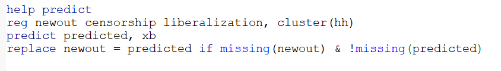

```{r setup, include=FALSE}
knitr::opts_chunk$set(echo = TRUE, eval=TRUE, warning=FALSE, message=FALSE)
```

# Today's plan

> - Multiple outcomes

> - Missing data

> - Power analysis


# Review of concepts

> - Testing multiple hypotheses increases the probability of \textcolor{red}{type I} (false \textcolor{red}{Positives}) or \textcolor{blue}{type II} error (false \textcolor{blue}{Negatives})

> - We want to test multiple hypotheses: different behavioral outcomes, votes in multiple elections etc

> - Popular strategies: 
>   - Summarize different measures in a single one
>   - Adjust p-values for multiple comparisons


# Principal Component Analysis

> - Reduce dimensionality of the outcomes by extracting shared variation along different dimensions

> - Returns estimates of "principal components" that are orthogonal to each other

> - We can use the principal components scores (usually the first one) as a single outcome that "summarizes" the shared variation

> - Stata: `pca`. R: `prcomp`, `princomp`

# Example

The effect of military repression on support for democracy

{width=75%}


# Principal Component Analysis
```{r, echo=F}
library(quantreg); library(haven); library(dplyr); library(ggplot2)

# Import data
d <- read_dta("FinalDatasetForReplication.dta") 

# Prepare
d <- d %>% filter(MainSample == 1)
```

\tiny
```{r}
vars <- c("Share_reg70_w2", "VoteShareNo", "VoteShareNo_pop70")
pca <- prcomp(d[,vars], center=T, scale=T)
pca
```

# Screeplot
\tiny
```{r, fig.align="center", fig.height=5}
data.frame(number=c(1:3), Eigenvalues = (pca$sdev)^2) %>% 
  ggplot(aes(x=number, y=Eigenvalues)) + geom_point() + geom_line() + theme_bw()
```


# Principal Component Analysis

- Can also pass the PCA output through the package `factoextra` \pause

\tiny
```{r, fig.align="center", fig.height=5}
library(factoextra)
fviz_eig(pca, choice = "eigenvalue")
```


# Principal Component Analysis

> - First factor can be used as outcome in the regression

> - Factors are estimates. For correct inference, incorporate their uncertainty in inference on the effect

> - Can bootstrap (sample code in this week's folder)


# Inverse Covariance Weighting

> - Summarizes outcome variables along just one dimension 

> - Weighted by inverse covariance in order to downplay common information across variables

> - Code by Cyrus: [Stata and R code](https://github.com/cdsamii/make_index) 


# p-value adjustment

- Most standard p-value adjustment methods implemented in R by `p.adjust`

\tiny
```{r}
# Generate p-values from different tests
set.seed(1)
p <- sort(runif(10, 0.03, 0.07))
d <- data.frame(p = p, 
                bonferroni = p.adjust(p, method = "bonferroni"))
d
```


# Implementing p-value adjustments

> - Summary of Stata packages for adjustment options by [David McKenzie](https://blogs.worldbank.org/impactevaluations/updated-overview-multiple-hypothesis-testing-commands-stata)

> - Sample code from McKenzie in this week's folder


# Missing data

> - Random missingness

> - Non-parametric methods: bounds

> - Parametric methods: imputation


# Example

The effects of censorship in authoritarian regimes

{width=75%}


# Baseline results (full data)
\tiny
```{r}
library(haven); library(estimatr); library(modelsummary); library(tidyverse); library(ggpubr)
d <- read_dta("Censorship.dta")

# Reproduce col 1 of table 1
mod <- lm_robust(ak_rating ~ censorship + liberalization, clusters = hh, se_type = "stata",
                 data = d)
modelsummary(mod, coef_omit = "Int", output = "markdown")

```


# Missing Completely at Random
\tiny
```{r}
set.seed(123)

nboot <- 500

cens <- lib <- rep(NA,nboot)

# 20% of outcome values are missing in the data
for (i in 1:nboot){
  d <- d %>% mutate(newout = ifelse(runif(nrow(d),0,1)<0.2, NA, ak_rating))
  fit <- update(mod, newout ~ .)
  cens[i] <- coef(fit)["censorship"]
  lib[i] <- coef(fit)["liberalization"]
}

plot1 <- ggplot(as.data.frame(cens)) + geom_density(aes(x=cens), col="red") +
  labs(x="Estimate", title = "Censorship") + 
  geom_vline(xintercept = mean(cens), col="red", linetype = "dashed") +
  geom_vline(xintercept = coef(mod)["censorship"], col="blue") + theme_bw()

plot2 <- ggplot(as.data.frame(lib)) + geom_density(aes(x=lib), col="dark green") +
  labs(x="Estimate", title = "Liberalization") + 
  geom_vline(xintercept = mean(lib), col="dark green", linetype = "dashed") +
  geom_vline(xintercept = coef(mod)["liberalization"], col="blue") + theme_bw()
```

# Missing Completely at Random
\tiny
```{r, fig.align="center", fig.height=5}
ggarrange(plot1, plot2)

```
\pause


# Missing at Random
\tiny
```{r}

# Suppose during censorship people express negative attitudes by non-responding
set.seed(123)

nboot <- 500

cens <- lib <- rep(NA,nboot)

for (i in 1:nboot){
  d <- d %>% mutate(newout = ifelse(rnorm(nrow(d), mean = d$censorship)>1.15, 
                                    NA, ak_rating))
  fit <- update(mod, newout ~ .)
  cens[i] <- coef(fit)["censorship"]
  lib[i] <- coef(fit)["liberalization"]
}

plot1 <- ggplot(as.data.frame(cens)) + geom_density(aes(x=cens), col="red") +
  labs(x="Estimate", title = "Censorship") +
  geom_vline(xintercept = mean(cens), col="red", linetype = "dashed") +
  geom_vline(xintercept = coef(mod)["censorship"], col="blue") + theme_bw()

plot2 <- ggplot(as.data.frame(lib)) + geom_density(aes(x=lib), col="dark green") +
  labs(x="Estimate", title = "Liberalization") +
  geom_vline(xintercept = mean(lib), col="dark green", linetype = "dashed") +
  geom_vline(xintercept = coef(mod)["liberalization"], col="blue") + theme_bw()

```


# Missing at Random
\tiny
```{r, fig.align="center", fig.height=5}
ggarrange(plot1, plot2)
```


# Point identification with missingness

> - MCAR: in expectation the estimates are unbiased

> - MAR: can use covariates that determine missingness to impute the missing values of the outcome 

# Imputation with regression
\tiny
```{r}
# Predicted values from the regression
d <- d %>% mutate(predicted = predict(fit, newdata = d))

# Replace missing outcomes with imputed values
d <- d %>% mutate(impy = ifelse(is.na(newout), predicted, newout))
```

In Stata you can use the post-estimation command `predict`




# Multiple imputation with MICE
\tiny
```{r}
library(mice)
m1 <- mice(data = zap_labels(d[,c("newout", "censorship", "liberalization",
                                  "sed", "education")]), 
           maxit = 5, printFlag = FALSE)
d_imp <- complete(m1)

length(d$newout[is.na(d$newout)])
length(d_imp$newout[is.na(d_imp$newout)])
```


# Bounds 

> - If MAR assumption seems unjustified, we can estimate bounds on causal effects

> - Manski bounds: also called "worst case" bounds 

> - Fill missing outcomes using the bounds of potential outcomes

# Manski bounds
Formally:

$$
\begin{aligned}
\beta^L \leq ATE \leq \beta^H \\
\beta^L = \{\mu_{1,obs} Pr[R_{1i}=1] + {\color{blue}y_1^L} Pr[{\color{red}R_{1i=0}}]\} - \\
\{\mu_{0,obs}Pr[R_{0i}=1]+ {\color{blue}y_0^H}Pr[{\color{red}R_{0i}=0}]\} \\
\beta^H = \{\mu_{1,obs} Pr[R_{1i}=1] + {\color{blue}y_1^H} Pr[{\color{red}R_{1i=0}}]\} - \\
\{\mu_{0,obs}Pr[R_{0i}=1]+{\color{blue}y_0^L} Pr[{\color{red}R_{0i}=0}]\}
\end{aligned}
$$
\pause

- $\{y_t^L, y_t^H\}$ straightforward when the outcome is bounded, e.g. binary (just replace every missing $y$ with 0 or 1)

- Otherwise, they are not

- If the bounds are very large, the set of possible effects can be too large

# Manski bounds
Implementation:

- Manually
- R: `ATbounds` [(vignette)](https://cran.r-project.org/web/packages/ATbounds/vignettes/ATbounds_vignette.pdf), `attrition` by Alex Coppock [(download from GitHub)](https://alexandercoppock.com/attrition/)

\tiny
```{r}
#install.packages("ATbounds")
#library(ATbounds)

#install.packages(devtools)
#library(devtools)
#install_github("acoppock/attrition")
```


# Lee bounds

> - Motivation: provide bounds on the causal effect even with unbounded outcome

> - Trade-off: assume more structure on the data, but weaker than "exclusion restrictions" necessary for other strategies

> - Relies on monotonicity assumption similar to that used for LATE identification, but in this case it serves to solve sample selection

# Lee bounds
Assumptions:

$$
\begin{aligned}
(Y_{1i}^*, Y_{0i}^*, R_{1i}, R_{0i}) \perp D  \\
R_{1i} \geq R_{0i}
\end{aligned}
$$

Under these assumptions, Lee (2009) proves that we can identify bounds for the ATE *for the sub-population* $\{R_{0i}=1, R_{1i}=1\}$.

$$
\begin{aligned}
\Delta_0^{LB} = E[Y|D=1, R=1, Y \leq y_{1-p0}] - E[Y|D=0, R=1] \\
\Delta_0^{UB} = E[Y|D=1, R=1, Y \geq y_{p0}] - E[Y|D=0, R=1]\\
p_0 = \frac{Pr[R=1|D=1] - Pr[R=1|D=0]}{Pr[R=1|D=1]}
\end{aligned}
$$


# Lee bounds
Implementation:

- R: `leebounds` (install_github("vsemenova/leebounds"))
- Stata: `leebounds`

# Lee bounds
\tiny
```{r}
library(leebounds)

input <- d %>% mutate(sel = ifelse(is.na(newout),0,1)) %>% 
  select(c(censorship, newout, sel)) %>%
  rename(treat = censorship, outcome = newout, selection = sel)

do.call("rbind", leebounds(input))
```