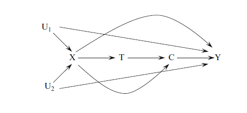
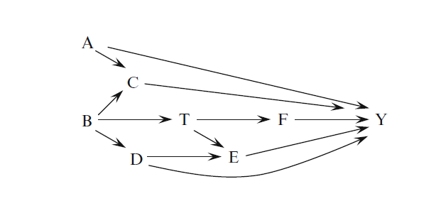
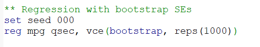
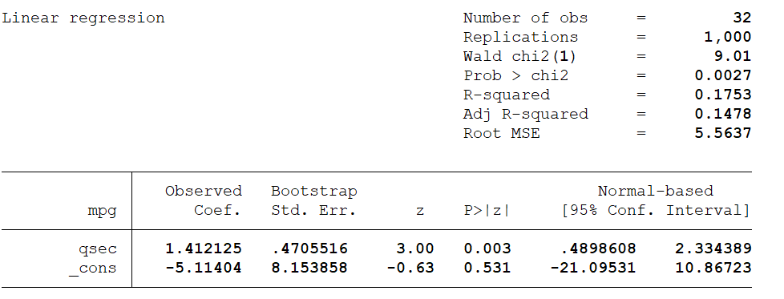
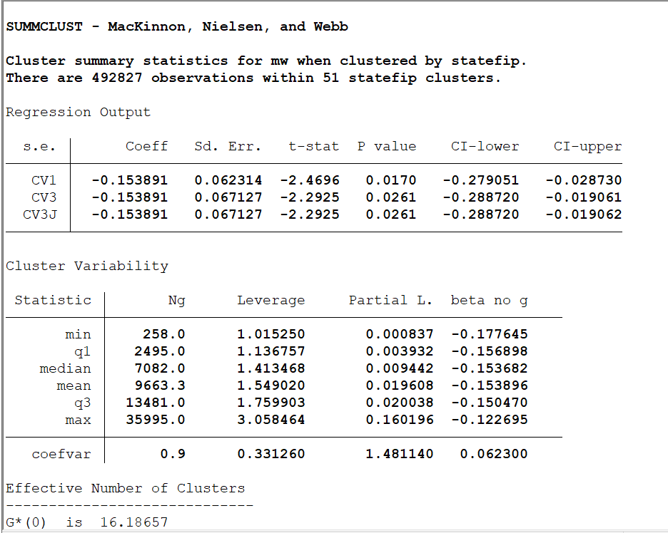
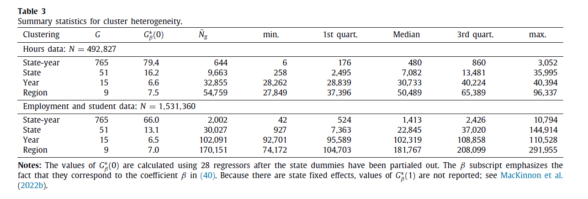
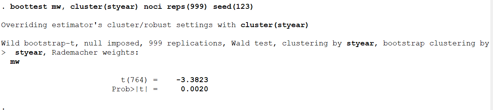

```{r setup, include=FALSE}
knitr::opts_chunk$set(echo = TRUE, eval=TRUE, warning=FALSE, message=FALSE)
```


# Today's plan
> - DAG Review
> - Bootstrap
> - Clustering 

# Housekeeping
- Homework 1 due February 14 before class
- Email to me, cc Cyrus
- Send code and output (.Rmd or pdf + file)
- Math can be scanned and attached (or from tablet), no need to compile in LaTeX

# DAG Review
> - Represent causal mechanisms, i.e. causal relationship between different variables
> - Non-parametric: silent about distribution, functional form, effect magnitude
> - 3 elements: variables, arrows, missing arrows
> - Arrow: direct causal effect
> - Missing arrow: no causal effect
>   - **Exclusion restrictions**: where assumptions are
> - Acyclic: cannot come back to starting point

# DAG Review
Important concepts:

- A $\to$ B: B is *children* of A, A is *parent* of B
- A $\to$ C $\gets$ B: C is a *collider*
- Causal path (relative to T): arrows go from T towards Y
- Non-causal path (relative to T): the others
- Backdoor path: non-causal path between T and Y
- Colliders block non-causal paths
- Conditioning on colliders open new non-causal paths

# DAG Review



# DAG Review
Conditioning on some variable $w$ in a DAG is equivalent to do the following steps:

> - If $w$ is a collider, link all pairs of parents of $w$ by drawing an undirected edge between them
> - For any ancestor of $w$, if this ancestor is itself a collider, link all pairs of parents of this ancestor with undirected edges to connote induced dependencies
> - Erase $w$ from the graph and all the edges connected with $w$

# DAG Review



# Collider bias


# Bootstrap
> - Simulate sampling distributions (from repeated random sampling) using the available sample
> - Parametric, Semi-parametric, Non-parametric
> - **Non-parametric**: based on re-sampling 
> - Random re-sampling from the sample approximates random sampling from the population
> - The sampling distribution of statistics from re-samples approximates the true sampling distribution

# Non-parametric bootstrap
1. From our sample of size $N$, draw a random sample of size $N$ with replacement

2. On this sample, compute the estimate

3. Repeat many times (e.g. 1000)

4. Obtain a distribution of estimates from the resamples (a bootstrapped sampling distribution)

5. For inference, compute moments of the bootstrapped distribution: e.g. sd, quantiles

# Non-parametric bootstrap
Advantages:

- No distributional assumptions
- Inference on functions of estimators

\tiny
```{r}
set.seed(123)
# Population
pop <- rnorm(10000)

# Sample
S <- sample(pop, 500)

# Estimate Mean(x) - Median(x)
delta <- mean(S)-median(S)

# Bootstrap inference
nboot <- 1000
ests <- rep(NA, nboot)
for (i in 1:nboot){
  ids <- sample(1:length(S), length(S), replace=T)
  s <- S[ids]
  ests[i] <- mean(s)-median(s)
}
```


# Non-parametric boostrap
\tiny
```{r, fig.align='center', fig.width=4, fig.height=3}
# Bootstrapped distribution
hist(ests, main="Bootstrapped sampling distribution")

```

# Non-parametric bootstrap
```{r}
# SE
sd(ests)

# CI
delta + quantile(ests, c(0.025, 0.975))
```

# Non-parametric bootstrap
We can also use the `boot` function

\tiny
```{r}
set.seed(123)
library(boot)
# Function for the bootstrap estimate
bootfn <- function(data, id){
  s <- data[id]
  out <- mean(s)-median(s)
  out
}

bs <- boot(S, statistic = bootfn, R=1000)
```

# Non-parametric bootstrap
\tiny
```{r}
# Output:
bs

# Bias:
mean(bs[["t"]])-delta

# Std. error
sd(bs[["t"]])

```


# Bootstrap in regression
- Code manually
- `lm` + `sandwich`

\tiny
```{r}
library(sandwich);library(lmtest)
set.seed(000)
data("mtcars")
fit <- lm(mpg ~ qsec, mtcars)
coeftest(fit, vcov=vcovBS(fit, cluster=NULL, R=1000))
```

# Bootstrap in regression
- `lm` + `car`

\tiny
```{r}
library(car)
set.seed(000)
Boot(fit, f=coef, R=1000) 
# You can replace coef with more complex functions
```


# Bootstrap in regression
In Stata:



Output:



# Clustering
> - So far: we have adopted the perspective of clustered **sampling**
>   - For instance, we sample villages or electoral precincts: individual behavior (e.g. voting) is correlated within cluster
> - Next: perspective of clustered **treatment assignment** 
>   - For instance, we randomize a treatment at the housing block level, assignment is correlated within cluster
> - In both cases, relative to simple random process, units are contributing less information
> - Extreme case: perfect correlation
> - If we treat units as independent, we overstate the information in the data, and underestimate the variance of the estimator

# Guide to empirical practice
Source: [MacKinnon, Nielsen, and Webb (JE, 2023)](https://www.sciencedirect.com/science/article/pii/S0304407622000781)

# Level of clustering
> - In observational work we do not perfectly observe the cluster structure: needs to be established by the researcher
> - "How do you cluster SEs?"
> - Traditional rules of thumb:
>   - When in doubt, cluster at the highest possible level
>   - Choose the level which gives the highest SEs
> - DiD setting: cluster at the unit level
>   - Can also cluster in two dimensions if suspects of correlation along other dimensions
> - Treatment assigned at a higher level: cluster at that level 
>   - E.g. individual-level data, geographic distances at place level
> - Tests for cluster level (Ibragimov and Mueller): estimate model for each cluster and compare variation in estimates with the one under finer clusters. Only works if treatment varies within cluster

# Leverage and influence
> - High heterogeneity between clusters can create problems for inference
>   - Results can be sensitive to the exclusion of few clusters
>   - Influential cluster (analogous to single observations)
> - Recommended to plot distribution of estimates from exclusion of each cluster sequentially

# Leverage and influence
Main problems:

> - Only one or few clusters are treated
> - Some clusters are especially large
>   - Over-rejection increases by a lot
>   - Example: Delaware contains 50+$\%$ of US incorporations
> - The opposite (a few small clusters) is generally not problematic
> - Only a few clusters have treated observations

# Summary guide
1. List all possible clustering dimensions and levels for the data, make informed decision regarding clustering structure
2. For each possible level, report the n. of clusters and the distribution of cluster sizes
3. For key regression specifications, report info on leverage, partial leverage and influence, especially the effective number of clusters for coefficients of interest $\implies$ `summclust` in Stata
  - Is leverage collinear with cluster size?
4. In addition to the CV1 estimator (the most common), use also the jack-knife based CV3 ($\implies$ `summclust`) and WCR ($\implies$ `boottest`)
5. If treatment at cluster level and few treated/control clusters, check with other methods (e.g. randomization inference)

If you have many clusters of similar size and good treatment variation across clusters you are fine

# Summclust
`summclust mw, yvar(hours2) xvar(black female) fevar(educ age year state) cluster(state) rho(0.5) jack`

{width=40%}


# Summclust
{width=90%}


# Cluster-robust standard errors in regression
\tiny
```{r}
library(sandwich)
# Work with MNW example dataset
d <- read.csv("min_wage_teen_hours2.csv")

# lm + sandwich
fit <- lm(hours2 ~ mw + black + female + factor(educ) + factor(age) + factor(year) + factor(statefip), d) 

coeftest(fit, vcov=vcovCL(fit, cluster = ~ statefip))["mw",]

```


# Cluster-robust standard errors in regression
\tiny
```{r}
# lfe
library(lfe)
fit <- felm(hours2 ~ mw + black + female | educ + age + year + statefip | 0 | statefip, d) 
summary(fit)

```


# Cluster-robust standard errors in regression
\tiny
```{r}
# fixest
library(fixest)
fit <- feols(hours2 ~ mw + black + female | educ + age + year + statefip, cluster=~statefip, data=d) 
etable(fit, keep = c("mw"))

```


# Cluster-robust standard errors in regression
In Stata:

`vce(cluster clustervar)`


# Cluster bootstrap
> - Most commonly used: Wild Cluster Bootstrap (Restricted)
> - Run the regression, estimate $\hat{\beta}$ and $t$
> - To test the null hypothesis: run the regression under the null hypothesis (i.e. setting $\beta=0$)
> - Resample clusters. For each cluster, multiply the residuals by +1 or -1 with equal chance
> - Predict new $y$s with the new residuals and imposing $\beta=0$
> - Re-estimate the model for all parameters and find $\hat{\beta}_b$
> - Compute $t$-statistic $t_b$ from the new estimates
> - Repeat many times
> - Compute bootstrap p-values by counting the share of simulated $t_b$ to the left/right of the observed one $t$

# Cluster bootstrap
- In Stata: `boottest`
- Computes bootstrap p-value and confidence interval, but not the standard error



# Cluster bootstrap
In R:

> - Option `cluster` in `sandwich::vcovBS()`
> - The package `fwildclusterboot` is a translation of Stata's `boottest` (same options)
>   - Function `boottest` works with objects of class `lm`, `felm`, `fixest`
> - Another option is the package `multiwaycov` and the function `cluster.boot` which can be used for post-estimation SE calculation (e.g. in `coeftest` or `stargazer`)