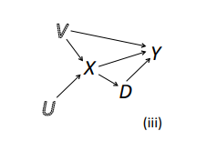
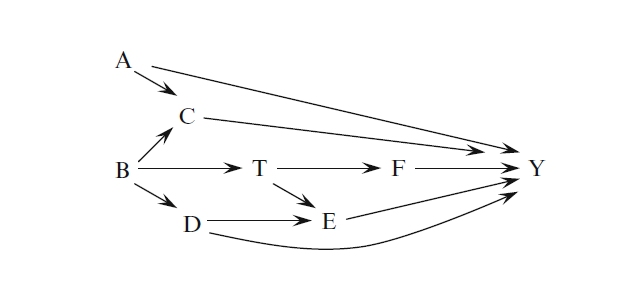
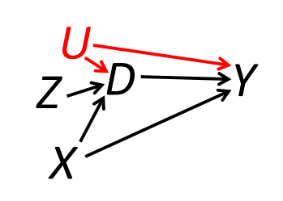

```{r setup, include=FALSE}
knitr::opts_chunk$set(echo = TRUE, eval=TRUE, warning=FALSE, message=FALSE)
```


# Today's plan
> - Inference on SATE and PATE
> - Neyman variance estimator
> - Bounds on the variance of SATE estimator
> - Connection to robust standard errors
> - Covariate adjustment
> - DAGs in R


# Simulations
> - Very important tool 
> - Theoretical properties of estimators can be better understood by observing them in simulated data
> - For empirical researchers, simulating the DGP allows to study properties of research designs such as power 
>   - Design stage of experiment or observational study
> - If in doubt, simulation is a valid option


# Causal estimands in randomized experiments
> - PATE: Population Average Treatment Effect
> - SATE: Sample Average Treatment Effect
> - Two sources of random variation
>   - Sampling from population
>   - Treatment assignment
> - SATE is a fixed quantity within the sample, but a random variable with respect to sampling from population
> - What do we "average" over?
> - Plot...
> - When do we care about SATE per se?


# Inference on causal estimand

- Estimator: Difference in means

$$
\hat{\rho}=\bar{Y}_1 - \bar{Y}_0
$$

- $\hat{\rho}$ is unbiased for SATE under random assignment

- $\hat{\rho}$ is also unbiased for PATE under random assignment *and* random sampling

- Estimate of variance of the estimator


# Neyman variance estimator
Recall the Neyman estimator for the variance of the difference in means $\hat{\rho}$

$$
\hat{V}^{ney} = \frac{\hat{s}^2_{Y_1}}{N_1} + \frac{\hat{s}^2_{Y_0}}{N_0}
$$

Different interpretations:

- $\hat{V}^{ney}$ is a biased (upward) estimate of $V_D[\hat{\rho}|S]$, given by randomization in the sample
  - Used to make inference about SATE, conservative so works "against" the researcher

- $\hat{V}^{ney}$ is an unbiased estimate of $V_D[\hat{\rho}|S]$, given by randomization in the sample, if the individual treatment effects are constant/POs perfectly correlated
  - Used to make inference about SATE
  
- $\hat{V}^{ney}$ is an unbiased estimate  of $V[\hat{\rho}]$ given by randomization in the sample *and* sampling (Imbens and Rubin, Ch.6)
  - Used to make inference about PATE
  
- Simulation to see these properties


# Simulation

\tiny
```{r} 
# Set seed
set.seed(123)

# Assume a large super population
N_pop <- 100000

# We simulate the potential outcomes for each observation 
Y0 <- abs(rnorm(N_pop, mean = 5, sd = 2))
Y1 <- Y0 + rnorm(N_pop, 0, 5) + 4 

# Note that the PATE is ~ 4 by construction
TE <- Y1 - Y0
(PATE <- mean(TE))
```


# Simulation

\tiny
```{r}
# Extract a random sample from this super-population
Nsample <- 1000
pop <- data.frame(Y0 = Y0, Y1 = Y1, TE = TE)
sample <- pop[sample(nrow(pop), size = Nsample),]


# What is the SATE?
(SATE <- mean(sample$TE))
```


# Simulation

\tiny
```{r}
# Simulate the randomization distribution over this sample.

# Number of iterations
Nboot <- 1000

# An empty vector where to store the estimates
dim <- vars <- rep(NA, Nboot)

# Start loop
for(i in 1:Nboot){
  # Treatment assignment to half units (complete randomization)
  sample$D <- 0
  sample$D[sample(Nsample, Nsample/2)] <- 1
  
  # Observed potential outcomes
  sample$Y <- sample$D*sample$Y1 + (1-sample$D)*sample$Y0
  
  # Compute DiM (estimate for SATE) and store it
  dim[i] <- mean(sample$Y[sample$D==1]) - mean(sample$Y[sample$D==0])
  
  # Compute variance (estimate for V(SATE)) and store it
  vars[i] <- var(sample$Y[sample$D==1])/(Nsample/2) + var(sample$Y[sample$D==0])/(Nsample/2)
}

```


# Simulation

\tiny
```{r}
# We now have a simulated randomization distribution of differences in means
# We know this is unbiased for the SATE
mean(dim)


# What is the variance of this estimator in the randomization distribution?
var(dim)

# What is the expected value of the variance estimator we computed?
mean(vars)

```


# Simulation

\tiny
```{r}
# Finally, let's compute the sampling variance of DIM under both randomization and sampling distribution
# Here the simulation has two levels: 
# (i) we do an outer loop where we randomly draw samples from the super population
# (ii) we do an inner loop where for each sample we compute the randomization distribution, as before

# Number of sample draws to do
Nsampling <- 100

# Matrices and vectors where to store the results
dim <- vars <- matrix(NA, Nsampling, Nboot)

# Begin loop
for(j in 1:Nsampling){
  # New random sample
  sample <- pop[sample(nrow(pop), size = Nsample),] 
    
  # Inner loop: randomization distribution
    for(i in 1:Nboot){
      # Treatment assignment to half units (complete randomization)
      sample$D <- 0
      sample$D[sample(Nsample, Nsample/2)] <- 1
      
      # Observed potential outcomes
      sample$Y <- sample$D*sample$Y1 + (1-sample$D)*sample$Y0
      
      # Compute simple difference in means (estimate for SATE) and store it
      dim[j,i] <- mean(sample$Y[sample$D==1]) - mean(sample$Y[sample$D==0])
      
      # Compute variance (estimate for V(SATE)) and store it
  vars[j,i] <- var(sample$Y[sample$D==1])/(Nsample/2) + var(sample$Y[sample$D==0])/(Nsample/2)
    }
}

```


# Simulation

\tiny
```{r}
# We know that the DIM is unbiased also for the PATE
mean(dim)

# What is the variance of this estimator in the sampling and randomization distribution?
var(as.vector(dim))

# Note that we can also compute the "true" (theoretical) value
# using the population values
var(Y1)/(Nsample/2) + var(Y0)/(Nsample/2)

# What is the expected value of the Neyman variance estimator?
mean(vars)
```


# Simulation

- Under sampling and randomization distribution the variance of the DIM estimator is larger
- Not surprising: we have two sources of uncertainty (or noise) to account for
- But we are able to estimate it without bias using sample quantities


# Interval estimator for DiM variance
> - Neyman estimator is conservative for $V_D[\hat{\rho}|S]$ in the randomization distribution: upper bound
> - This approximation is due to ignorance of the covariance between POs
> - We can derive some more information about covariance from observable quantities
>   - E.g. if one PO is constant, the covariance is 0
> - From this information we can derive bounds around the covariance value and thus around the variance
> - Aronow, Green, and Lee (2014): provide interval estimator for the variance
> - Intuition: extreme values (bounds) of covariance corresponds to cases of comonotonicity/countermonotonicity
> - In these cases, the joint distribution function can be estimated from the data

# Aronow, Green, and Lee

\tiny
```{r}
# Function for computing the bounds estimates
sharp.var <- function(yt, yc, N=length(c(yt,yc)), upper=TRUE){
  m <- length(yt);  n <- m + length(yc)
  FPvar <- function(x,N) (N-1)/(N*length(x)-1)*sum((x-mean(x))^2)
  yt <- sort(yt)
  if(upper==TRUE) {yc <- sort(yc)} else {yc <- sort(yc, decreasing=TRUE)}
  p_i <- unique(sort(c(seq(0,n-m,1)/(n-m),seq(0,m,1)/m))) - .Machine$double.eps^.5
  p_i[1] <- .Machine$double.eps^.5
  yti <- yt[ceiling(p_i*m)]
  yci <- yc[ceiling(p_i*(n-m))]
  p_i_minus <- c(NA, p_i[1:(length(p_i)-1)])
  return(
    ((N-m)/m * FPvar(yt,N) + (N-(n-m))/(n-m) * FPvar(yc,N) + 2*sum(((p_i-p_i_minus)*yti*yci)[2:length(p_i)]) -
       2*mean(yt)*mean(yc))/(N-1))
}
```


# Aronow, Green, and Lee

\tiny
```{r}
bounds <- c(sharp.var(sample$Y[sample$D==1], sample$Y[sample$D==0],
                      N=nrow(sample), upper=F),
            sharp.var(sample$Y[sample$D==1], sample$Y[sample$D==0],
                      N=nrow(sample), upper=T)
            )

bounds
```


# Regression standard errors for causal effects
> - The Neyman estimator contains the notion of heteroskedasticity
>   - Variance of potential outcomes varies with levels of the treatment
> - Samii and Aronow (2012) show that Neyman estimator is equivalent to HC2 heteroskedasticity-robust estimator
> - Simulation with `estimatr` 


# Equivalence of Neyman SE and robust regression SE

\tiny
```{r}
## Simulate a randomized experiment
set.seed(123)
library(dplyr); library(estimatr)

# Simulated population
pop <- data.frame(Y1 = rnorm(1000, 4, 2), Y0 = rnorm(1000, 0.5, 3))

# Random sample
sample <- pop[sample(nrow(pop), 100),]
sample$D <- 0
sample$D[sample(100, 30)] <- 1

# Observed potential outcomes
sample <- sample %>% mutate(Y = D*Y1 + (1-D)*Y0)

# Compute the Neyman SE manually
(ney_se <- sqrt(var((sample$Y[sample$D==1]))/sum(sample$D==1) + var((sample$Y[sample$D==0]))/sum(sample$D==0)))

# Regression with HC2 robust SE
lm_robust(Y ~ D, data = sample)

# Note this is different from HC1 (the Stata default)
lm_robust(Y ~ D, data = sample, se_type = "stata")

```

# Robust variance estimators for the Difference in Means
See Imbens and Rubin Ch.7 and MHE Ch.8 (be aware of notation)

$\hat{s}^2_{Y_j} = \frac{\sum_{i:D_i=j}^{N_j}(Y_i - \bar{Y}_j)^2}{N_j-1}$

- Non-robust/conventional: $\hat{s}^2_Y(\frac{1}{N_1} + \frac{1}{N_0})$
- HC0: $\frac{N_0 -1}{N_0^2}\hat{s}_{Y_0}^2 + \frac{N_1 -1}{N_1^2}\hat{s}_{Y_1}^2$
- HC1: $\frac{N}{N-2}\biggl(\frac{N_0 -1}{N_0^2}\hat{s}_{Y_0}^2 + \frac{N_1 -1}{N_1^2}\hat{s}_{Y_1}^2\biggr)$
- HC2: $\frac{\hat{s}^2_{Y_1}}{N_1} + \frac{\hat{s}^2_{Y_0}}{N_0}$
- HC3: $\frac{\hat{s}^2_{Y_1}}{N_1-1} + \frac{\hat{s}^2_{Y_0}}{N_0-1}$


# Covariates
> - In a randomized experiment, they are not needed for identification
> - Why?
> - They can be introduced for efficiency reasons
>   - Efficiency?
> - Intuition: reduce the unexplained variation of the outcome, reduce the standard error on the causal estimate
> - Works for large samples (consistent), in small samples can introduce bias

# Covariates
Regression-adjusted estimator proposed by Lin (2013): $\hat{\rho}^{reg}$ from

$$
Y_i = \alpha + \rho^{reg}D_i + \beta \tilde{X}_i + \gamma D_i * \tilde{X}_i + \varepsilon_i
$$

where $\tilde{X}_i = X_i - \bar{X}_i$

Equivalent to estimating
$$
\begin{aligned}
\text{On Treated group: } Y_{1i} = {\color{red} \alpha_1} + {\color{red} \beta_1} \tilde{X}_{i} + \varepsilon_1 \\
\text{On Control group: } Y_{0i} = {\color{blue} \alpha_0} + {\color{blue} \beta_0} \tilde{X}_{i} + \varepsilon_0
\end{aligned}
$$
and

$$\hat{\rho}^{reg} = \hat{{\color{red} \alpha_1}} - \hat{{\color{blue}\alpha_0}} = \bar{Y}_1^{adj} - \bar{Y}_0^{adj}$$

# Covariates
Implementation with `estimatr::lm_lin()`

\tiny
```{r}
library(fabricatr);library(randomizr)

set.seed(000)

dat <- fabricate(N=40, x=rnorm(N, mean=2.3),
                 x2=rpois(N, lambda = 2),
                 x3=runif(N),
                 y0=rnorm(N)+x,
                 y1=rnorm(N)+x+0.35)
dat$z <- complete_ra(N=nrow(dat))
dat$y <- ifelse(dat$z==1, dat$y1, dat$y0)

# lm_lin
out1 <- lm_lin(y~z, covariates=~x, dat)
```


# Covariates
Alternatively

\tiny

```{r}
# lm_robust
dat$x_c <- dat$x-mean(dat$x)
out2 <- lm_robust(y~z*x_c, dat)

# Manually
fit1 <- lm(y ~ x_c, dat[dat$z==1,])
fit0 <- lm(y ~ x_c, dat[dat$z==0,])
rho <- coef(fit1)["(Intercept)"] - coef(fit0)["(Intercept)"]

# Compare all
c(coef(out1)["z"], coef(out2)["z"], rho)
```


# DAGs in R
- Analyze causal designs through the Dagitty package
- Study identification strategies: conditioning sets, instrumental variables

```{r}
library(dagitty)
```


# DAGs in R



```{r}
g1 <- dagitty( "dag {
    U -> X -> Y
    X -> D -> Y <- V -> X
}")
```


# DAGS in R

```{r}
children(g1, "X")

parents(g1, "D")
```

# DAGs in R

\tiny
```{r fig.align="center", fig.height=6}
plot(graphLayout(g1))
```

# DAGs in R

```{r}
print( impliedConditionalIndependencies( g1 ) )
```


# DAGs in R

```{r}
print( adjustmentSets( g1, "D", "Y", effect="direct" ) )
```


# DAGs in R

\tiny
```{r}
for( n in names(g1) ){
    for( m in children(g1,n) ){
        a <- adjustmentSets( g1, n, m, effect="direct" )
        if( length(a) > 0 ){
            cat("The coefficient on ",n,"->",m,
                " is identifiable controlling for:\n",sep="")
            print( a, prefix=" * " )
        }
    }
}
```

# DAGs in R



\tiny
```{r}
g2 <- dagitty( "dag {
    B -> T -> F -> Y
    T -> E -> Y
    B -> D -> E -> Y <- D
    B -> C -> Y
    B -> C <- A -> Y
}")
```


# DAGs in R

```{r fig.align='center', fig.height=6}
plot(graphLayout(g2))

```


# DAGs in R

```{r}
print( adjustmentSets( g2, "T", "Y", effect="total" ) )

```


# DAGs in R



```{r}
g3 <- dagitty( "dag {
    Z -> D -> Y <- X -> D
    U -> D -> Y <- U
}")

```


# DAGs in R
```{r}
print(instrumentalVariables(g3, "D", "Y"))
```