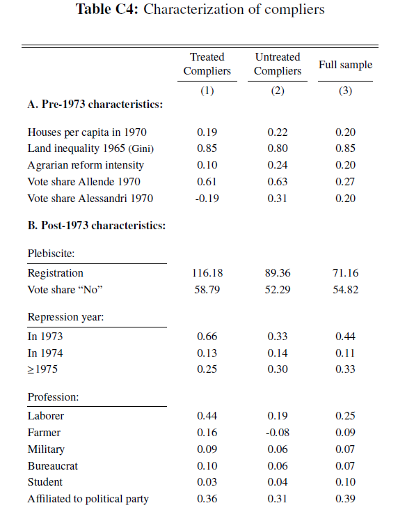
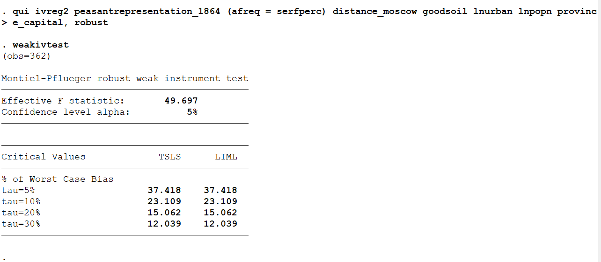
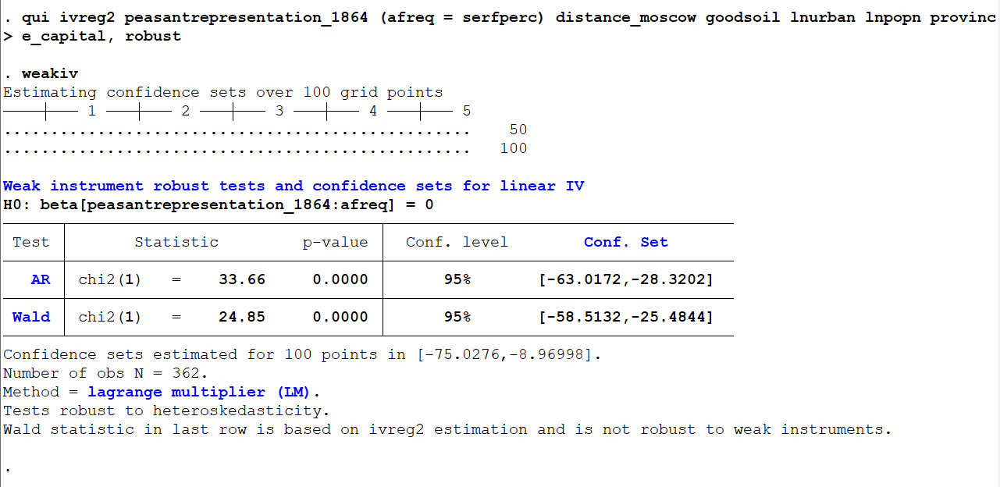

```{r setup, include=FALSE}
knitr::opts_chunk$set(echo = TRUE, eval=TRUE, warning=FALSE, message=FALSE)
```


# House-keeping
> - HW2 due Tuesday
> - Midterm on Thursday
> - No lab on Thursday

# Today's plan
> - Instrumental variables in practice
> - Characterize compliers
> - Weak instruments
> - Double ML

# Instrumental Variables
Principal Strata:

- Compliers: $D(1) = 1, D(0) = 0$
- Always-takers $D(1) = D(0) = 1$
- Never-takers $D(1) = D(0) = 0$
- Defiers: $D(1) = 0, D(0) = 1$


# IV in practice: peasant unrest and representation


# The effect of unrest on representation
\tiny
```{r}
library(haven); library(AER); library(stargazer)
data <- read_dta("DFGN_cleaned.dta")

## OLS
olsfit <- lm(peasantrepresentation_1864 ~ afreq + distance_moscow + 
               goodsoil + lnurban + lnpopn + 
               province_capital, data)

## IV (1): serfdom
ivfit1 <- ivreg(peasantrepresentation_1864 ~ afreq + distance_moscow + 
                  goodsoil + lnurban + lnpopn + province_capital | serfperc1 +
                  distance_moscow + goodsoil + lnurban + lnpopn +
                  province_capital, data=data)

## IV (2): religious polarization
ivfit2 <- ivreg(peasantrepresentation_1864 ~ afreq + distance_moscow + 
                  goodsoil + lnurban + lnpopn + province_capital | religpolarf4_1870 + 
                  distance_moscow + goodsoil + lnurban + lnpopn +
                  province_capital, data=data)

mod <- list(olsfit, ivfit1, ivfit2)
ses <- lapply(mod, function(x) coeftest(x, vcov = vcovHC(x, type = "HC1"))[,"Std. Error"])
labs <- c("", "Z: % serfs", "Z: religious pol.")

```


# The effect of peasant unrest on representation
\tiny
```{r}
stargazer(mod, se = ses, column.labels = labs, omit.stat = c("f", "ser"), type = "text")

```


# Other IV packages
\tiny
```{r}
# lfe
library(lfe)
ivfit.felm <- felm(peasantrepresentation_1864 ~ distance_moscow + 
                  goodsoil + lnurban + lnpopn + province_capital | 0 | (afreq ~ serfperc1), data=data)

# fixest
library(fixest)
ivfit.feols <- feols(peasantrepresentation_1864 ~ distance_moscow + goodsoil +
                       lnurban + lnpopn + province_capital | afreq ~ serfperc1, 
                     vcov = "hc1", data=data)

# Compare
library(modelsummary)
mods <- list(ivfit.felm, ivfit.feols)
vcovs <- list(ivfit.felm$robustvcv, vcov(ivfit.feols))
modelsummary(list(ivfit.felm, ivfit.feols), vcov=vcovs, coef_omit = "^(?!.*fit)", output="markdown")
```

# Standard error note
> - Robust SE computed by Stata's `ivregress` are the HC0 type

> - Here we used HC1 (so SEs slightly different from the paper)

> - Make sure you cross-check documentation when translating to another language

# IV in Stata
> - Classic function: `ivregress` 

> - Now most popular and complete: `ivreg2` 

> - Versions for panel data: `xtivreg` and `ivreghdfe` 


# Characterize the compliers

> - Different strategies, not widely used: see [Marbach and Hangartner (2020)](https://www.cambridge.org/core/journals/political-analysis/article/profiling-compliers-and-noncompliers-for-instrumentalvariable-analysis/0E2AA51F9BD436A5DB5A84462732A9C3).

> - Simple regression-based technique:
>   - $X$: covariate. $D$: endogenous treatment. $Z$: instrument.
>   - Create $X^* = X*D$ and use it as outcome in the 2SLS model
>   - Coefficient of the instrumented $D$ is the mean of $Z$ among the treated compliers

> - Uses only treated compliers, thus inefficient (Marbach and Hangartner 2020)

> - To characterize untreated compliers, $X*(1-D)$ and replace $D$ with $1-D$ 

# Unrest compliers
\tiny
```{r}
# Variables used in the analysis
vars <- c("mliteracy_1897", "lingfrac_1897", "popdens1858",
          "percnobleown_1877", "districtfemale_1863")
exvars <- c("distance_moscow", "goodsoil", "lnurban", 
            "lnpopn", "province_capital")

# For simplicity, we collapse D and Z to a binary variable
data$D <- ifelse(data$afreq >= quantile(data$afreq, probs = 0.75, na.rm = T), 1, 0)
data$Z1 <- ifelse(data$serfperc1 >= quantile(data$serfperc1, 0.75, na.rm=T), 1, 0)
data$Z2 <- ifelse(data$religpolarf4_1870 >= quantile(data$religpolarf4_1870, 0.75, na.rm=T), 1, 0)


```


# Unrest compliers
\tiny
```{r}
##  Compliers' mean, regression method
mean_comp <- function(var, Z){
  require(AER); require(dplyr)
  data <- mutate(data, Xc = get(var)*D)
  formula <- paste0("Xc", "~", "D", "+", paste(exvars, collapse = " + "),
                    "|", Z, "+", paste(exvars, collapse = " + "))
  fit <- ivreg(as.formula(formula), data=data)
  return(coef(fit)["D"])
}

means_z1_t <- means_z2_t <- rep(NA, length(vars))

# Population distribution
means_full <- round(apply(data[data$zemstvo==1,vars], 2, function(x) mean(x, na.rm=T)), 3)

# Compliers of % serf
for(i in 1:length(vars)){means_z1_t[i] <- round(mean_comp(vars[i], "Z1"), 3)}

# Compliers of rel. pol.
for(i in 1:length(vars)){means_z2_t[i] <- round(mean_comp(vars[i], "Z2"), 3)}


```

# Unrest compliers
\footnotesize
```{r}
cbind(means_full, means_z1_t, means_z2_t)
```


# Another application: targeted repression


# Repression compliers


# Another approach
> - See discussion in MHE (p.166-172)
> - Derive unobservable features of compliers from the other groups
> - Intuition: "encouraged" never-takers and "non-encouraged" always-takers are observable in the data
> - Under exogenous instrument, they are similar to non-encouraged never-takers and encouraged always-takers (these two are unobservable in the data) 
> - Mean for always-takers: $\mathbb{E}[X|D(1)=D(0)=1] = \mathbb{E}[X|D=1, Z=0]$
> - Mean for never-takers: $\mathbb{E}[X|D(1)=D(0)=0] = \mathbb{E}[X|D=0, Z=1]$
> - Overall sample mean is an average of the group means: 
$$
\begin{aligned}
\mathbb{E}[X] \\
= \mathbb{E}[X| D(1)>D(0)]P[D(1)>D(0)] + \\ \mathbb{E}[X|D(1)=D(0)=1]P[D(1)=D(0)=1] + \\ \mathbb{E}[X|D(1)=D(0)=0]P[D(1)=D(0)=0]
\end{aligned}
$$

# Another approach

> - Rearrange to find the mean for compliers:

$$ 
\begin{aligned}
\mathbb{E}[X| D(1)>D(0)] = \\
\frac{\mathbb{E}[X]}{P[D=1|Z=1] - P[D=1|Z=0]} - \\
\frac{\mathbb{E}[X|D=1, Z=0]P[D=1|Z=0] - \mathbb{E}[X|D=0, Z=1]P[D=0|Z=1]}{P[D=1|Z=1] - P[D=1|Z=0]}
\end{aligned}
$$


> - Quantities identified in the data under exogeneity of the instrument

> - `ivdesc` package in R derives the complier mean

> - Standard error computed through bootstrap: reflects uncertainty in the estimation of means and proportions

> - Works for randomized experiments with binary instrument and treatment


# ivdesc
Application: field experiment on TV viewership

\tiny
```{r}
library(icsw); library(ivdesc)
data(FoxDebate)

 with(FoxDebate, ivdesc(X=readnews,D=watchpro,Z=conditn) )  %>% as.data.frame()

```


# kappa-weights
 - More general approach (Abadie 2003)
 - Following the same principle, constructs a weighting estimator: kappa-weighting 

$$
\mathbb{E}[X|D(1)>D(0)] = \frac{\mathbb{E}[k_iX_i]}{\mathbb{E}[k_i]}
$$ 

where

$$
k_i = 1 - \frac{D_i(1-Z_i)}{1-P(Z_i=1|X_i)} - \frac{(1-D_i)Z_i}{P(Z_i=1|X_i)}
$$

- Can re-weight the sample to compute moments of the complier distribution

- $P(Z_i=1|X_i)$ can be estimated with fitted values from LPM


# Weak instruments

> - Weak instruments: small correlation of the instrument with the endogenous treatment 

> - Exacerbate bias and make inference unreliable

# Test for weak instruments
> - Use the F-statistic of the first-stage regression
> - Stock \& Yogo (2005): provide critical values for rejecting the null of weak instrument
> - Results based on assumption of homoskedastic errors, hardly satisfied (Andrews, Stock \& Sun 2019)
> - Solutions: Robust F statistic. Equivalent to Kleibergen-Paap statistic for the case of a single regressor (Andrews, Stock \& Sun 2019)
>   - Reported automatically by `ivreg2` in Stata
> - Solutions: Effective first-stage F-statistic (Montiel Olea \& Pflueger 2013)
> - Equivalent to robust F in the just-identified case
> - Post-estimation command `weakivtest` in Stata (`ssc install weakivtest`)
> - With one instrument, Effective F can be compared to Stock \& Yogo critical values
- With multiple instruments, use the critical values in Montiel Olea \& Pflueger

# Test for weak instruments




# Inference with weak instruments

> - In just-identified case Anderson-Rubin test is efficient (Andrews, Stock \& Sun 2019)

> - `weakiv` package in Stata computes the AR confidence set (`ssc install weakiv`)

> - For the over-identified case, debate still ongoing


# Inference with weak instruments




# Double ML
> - Goal: estimation of treatment effect relaxing linear functional form assumption

> - Idea: Estimate conditional mean functions of $D$ and $Y$ with potentially complex functions of covariates

> - Then residua-residual regression of $\tilde{Y}$ on $\tilde{D}$

> - ML: "learn" functional form that best fits the data from data itself

# Double ML

`DoubleML` package

> - Several algorithms available for selecting the functional form

> - Basic intuitions (details in Quant 3):

> - LASSO: shrinkage/regularization for selecting predictors

> - Random trees/forest: predict through random splitting of sample


# Double ML

\tiny
```{r}
library(DoubleML); library(data.table); library(mlr3); library(mlr3learners)

### Initialize the data ###
## Covariates to use
X <- c("longitude", "latitude", "latitude2", "longitude2", "lingfrac_1897", "mliteracy_1897")

## Data for the model: need to be in data.table format 
## and must not have missing values

data_dml <- select(data, c(peasantrepresentation_1864, D, all_of(X))) %>% as.data.table() %>% na.omit()

data_dml <- DoubleMLData$new(data_dml, 
                             y_col = "peasantrepresentation_1864",
                             d_cols = "D")
```


# Double ML
\tiny
```{r}
# Initialize learners
set.seed(123)
lasso <- lrn("regr.cv_glmnet", nfolds = 3, s = "lambda.min")
lasso_class <- lrn("classif.cv_glmnet", nfolds = 3, s = "lambda.min")

# Initialize DoubleMLPLR model
dml_plr_lasso <- DoubleMLPLR$new(data_dml,
                                ml_l = lasso,
                                ml_m = lasso_class,
                                n_folds = 3)
dml_plr_lasso$fit()
dml_plr_lasso$summary()
```


