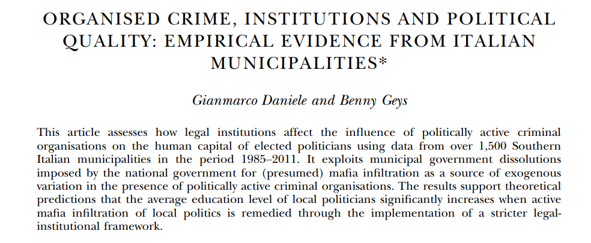
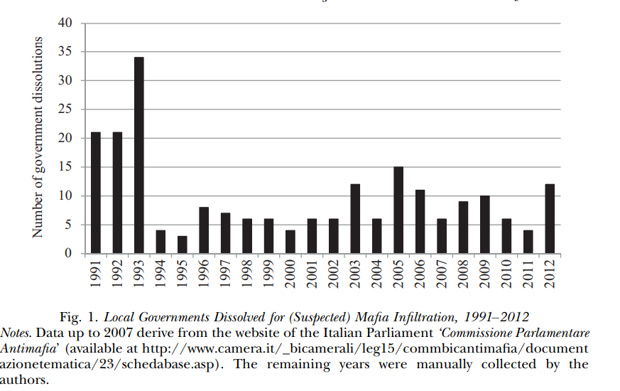
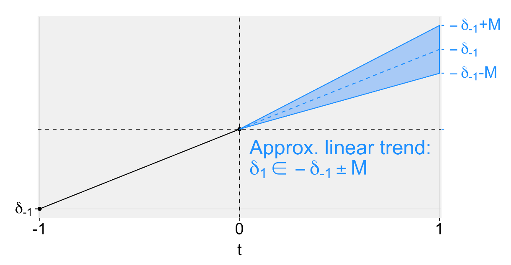

```{r setup, include=FALSE}
knitr::opts_chunk$set(echo = TRUE, eval=TRUE, warning=FALSE, message=FALSE)
```


# Today's plan
- Problems with TWFE under staggered treatment and alternatives
  - `did`, `did_multiplegt`, `twowayfeweights`
- Violations of parallel trends
  - `honestDID`


# Workhorse example

Mafia and political quality: Daniele \& Geys (EJ 2015)



# Workhorse example

- What is the effect of removing mafia connections on the quality of politicians?

- Staggered dissolution of municipal governments in Italian south after crimina investigations

- Outcome: education of government members (average)

- "Unlike the traditional DiD model, which relies on a shock at one point in time across all treated jurisdictions, we can exploit the fact that dissolutions did not take place at the same point in time for each municipality [...] to further strengthen our identification"


# Staggered treatment




# TWFE: Stata implementation


# TWFE: R implementation

\tiny
```{r}
library(tidyverse); library(haven); library(fixest)

dat <- read_dta("Organized Crime and Political Quality.dta")

dat <- mutate(dat, befcomgeneral_recode=(1-befcomgeneral)*mafiaben)

feols(MeanEduPol ~ befcomgeneral_recode + mafiaben | ID_municip[trend] + year, dat) %>% etable()
```


# Callaway & Sant'Anna

- $G_g$: group/cohort of units treated at $t=g$

- $t$: time

- $C$: group of never-treated units

- Target quantity: $ATT(g,t) = \mathbb{E}[Y_t(g) - Y_t(0) \mid G_g=1]$

- Assumptions: conditional parallel trends based on "never-treated" or "not-yet-treated" group, overlap


# Callaway & Sant'Anna

- First, define treatment groups based on their first year of treatment

\tiny
```{r}
library(did)

# Group variable
dat <- dat %>% group_by(desc_comune) %>% 
  mutate(group = case_when(mafiaben==1 ~ min(year[befcomgeneral_recode==1]),
                           mafiaben==0 ~ 0)) %>%
  ungroup()
```


# Callaway & Sant'Anna 

Basic implementation: never treated as controls, estimation through outcome regression

$$
\begin{aligned}
ATT^{new}_{or} (g,t,\delta) = \mathbb{E}\left[ \frac{G_g}{\mathbb{E}[G_g]} (Y_t - Y_{g-\delta-1} - m^{nev}_{g,t,\delta}(X))\right] \\
m^{nev}_{g,t,\delta}(X) = \mathbb{E}[Y_t - Y_{g-\delta -1}\mid X, C=1]
\end{aligned}
$$


# Callaway & Sant'Anna 

Basic implementation

\tiny
``` {r}
set.seed(1)
out <- att_gt(yname = "MeanEduPol",      # outcome variable
              gname = "group",           # group variable
              idname = "ID_municip",     # unit identifier
              tname = "year",            # year variable
              xformla = ~1,              # covariates (if any)
              data = dat,                # data
              est_method = "reg",        # estimation method
              allow_unbalanced_panel = T # allow unbalanced panel
              )
```


# Callaway & Sant'Anna 

Visualize the results:

\tiny
``` {r}
summary(out)
```


# Callaway & Sant'Anna 

Tidy format for result manipulation

\tiny
```{r}
tidy(out) %>% head()
```

# Callaway & Sant'Anna 

Graphical visualization
\tiny
```{r fig.height = 4, fig.align = "center"}
# By default makes a plot for each group, here we select a few because there are many
ggdid(out, group = 1992, xgap=3, title="", theming=F)+ theme_bw() 
```


# Callaway & Sant'Anna 

Graphical visualization
\tiny
```{r fig.height = 4, fig.align = "center"}
# By default makes a plot for each group, here we select a few because there are many
ggdid(out, group = 1993, xgap=3, title="", theming=F)+ theme_bw() 
```

# Callaway & Sant'Anna 

Graphical visualization
\tiny
```{r fig.height = 4, fig.align = "center"}
# By default makes a plot for each group, here we select a few because there are many
ggdid(out, group = 2005, xgap=3, title="", theming=F)+ theme_bw() 
```


# Callaway & Sant'Anna 
- Change the estimation method through the `est_method` argument

- `ipw`: weighting estimator
$$
ATT^{new}_{ipw}(g,t,\delta) = \mathbb{E}\left[ \left( \frac{G_g}{\mathbb{E}[G_g]} - \frac{\frac{p_g(X)C}{1-p_g(X)}}{\mathbb{E}\left[ \frac{p_g(X) C}{1-p_g(X)}\right]} \right) (Y_t - Y_{g-\delta-1})\right]
$$

- `dr`: doubly robust estimator
$$
ATT^{new}_{dr}(g,t,\delta) = \mathbb{E}\left[ \left( \frac{G_g}{\mathbb{E}[G_g]} - \frac{\frac{p_g(X)C}{1-p_g(X)}}{\mathbb{E}\left[ \frac{p_g(X) C}{1-p_g(X)}\right]} \right) (Y_t - Y_{g-\delta-1} - m^{nev}_{g,t,\delta}(X))\right]
$$


# Aggregate estimates
- Focus on $ATT(g,t)$ fully exploits TE heterogeneity (cost: more uncertainty)
- Aggregate the single estimates to obtain quantities of theoretical interest
- For instance, simple weighted average of all $ATT(g,t)$

\tiny
```{r}
aggte(out, type ="simple", na.rm=T)
```


# Aggregate estimates
Dynamic $ATT$s relative to treatment period (event-study)

\tiny
```{r}
aggte(out, type = "dynamic", na.rm=T) %>% tidy() %>%
  filter(event.time%in%seq(-5, 5, 1)) %>% select(term, event.time, estimate, std.error, conf.low, conf.high)
```


# Aggregate estimates
Group-level $ATT$s

\tiny
```{r}
aggte(out, type="group", na.rm=T) %>% tidy() %>%
  filter(group%in%c("1992", "1993", "2005")) %>%
  select(term, group, estimate, std.error, conf.low, conf.high)
```


# De Chaisemartin & D'Haultfoeuille

Main result in de Chaisemartin and D’Haultfœuille (2020) 

$$
E[\hat{\beta}_{fe}] = \left[\sum_{(g,t): D_{g,t}\neq 0} W_{g,t} TE_{g,t}\right]
$$

where 

$$
\begin{aligned}
TE_{g,t} = \bar{Y}_{g,t}(1) - \bar{Y}_{g,t}(0) \\
W_{g,t} = \frac{N_{g,t}}{N_1} \frac{e_{g,t}}{\sum_{(g,t):D_{g,t}\neq 0}\frac{N_{g,t}}{N_1}e_{g,t}} \\
e_{g,t} = D_{g,t} - D_{g,.} - (D_{.,t} - D_{.,.})
\end{aligned}
$$

Different from ATT formula, where the weights are $\frac{N_{g,t}}{N_1}$


# De Chaisemartin & D'Haultfoeuille
Implications:

- $W_{g,t}$ sum to 1, and some may be negative

- TEs with a negative weight enter the sum with opposite sign

- The estimate $\hat{\beta}_{fe}$ can even have the different sign

- Arises if $TE$s are correlated with weights or if $TE$ is heterogeneous

- Why: comparison of newly treated ("switchers") to already treated groups


# De Chaisemartin & D'Haultfoeuille

Two packages:

- `twowayfeweights`: estimate effect weights in the TWFE regression and diagnose possible problems

- `did_multiplegt`: implement an alternative estimator

$$
\begin{aligned}
DID_M = \sum_{t=2}^{T} \left(\frac{N_{1,0,t}}{N_S} DID_{+,t} + \frac{N_{0,1,t}}{N_S} DID_{-,t}\right) 
\end{aligned}
$$

# (cont.)
where 
$$
\begin{aligned}
DID_{+,t} = \sum_{g:D_{g,t}=1,D_{g,t-1}=0} \frac{N_{g,t}}{N_{1,0,t}} (Y_{g,t} - Y_{g,t-1}) - \\
\sum_{g:D_{g,t}=D_{g,t-1}=0} \frac{N_{g,t}}{N_{0,0,t}} (Y_{g,t} - Y_{g,t-1})
\end{aligned}
$$

$$
\begin{aligned}
DID_{-,t} = \sum_{g:D_{g,t}=D_{g,t-1}=1} \frac{N_{g,t}}{N_{1,1,t}} (Y_{g,t} - Y_{g,t-1}) - \\
\sum_{g:D_{g,t}=0, D_{g,t-1}=1} \frac{N_{g,t}}{N_{0,1,t}} (Y_{g,t} - Y_{g,t-1})
\end{aligned}
$$

# Stata implementation


# Honest DiD

- These methods fix estimation problems, not identification

- Rely on (conditional) parallel trends

- How do we address possible violations of the identification assumption?

- Arambachan & Roth (2022): sensitivity analysis approach

- Idea: use PT violations detected in pre-treatment periods to inform possible violations after the treatment


# Honest DiD

Simple DiD (non-staggered)

\tiny
```{r}
#remotes::install_github("asheshrambachan/HonestDiD")

mt <- read_dta("https://raw.githubusercontent.com/Mixtape-Sessions/Advanced-DID/main/Exercises/Data/ehec_data.dta")

# Make a simple non-staggered version
mt_ns <- mt %>% filter(year < 2016 & (is.na(yexp2)| yexp2 != 2015))

# Create a treatment dummy
mt_ns <- mt_ns %>% mutate(D = case_when(yexp2 == 2014 ~ 1, T ~ 0)) 

# TWFE model
twfe <- feols(dins ~ i(year, D, ref = 2013) | stfips + year, 
                        cluster = "stfips",
                        data = mt_ns)

```


# Honest DiD

\tiny
```{r fig.height=4, fig.align='center'}
iplot(twfe)
```


# Honest DiD

Sensitivity analysis 1: relative magnitude restrictions of PT violations

Call $\delta$ the difference in trends between treated and control

$$
\Delta^{RM}(\bar{M}) = \{\delta : \forall t \geq 0, |\delta_{t+1} - \delta_{t}| \leq \bar{M} \times \max_{s<0} |\delta_{s+1} - \delta_s| \}
$$

# Implementation

\tiny
```{r}
# Extract coefficients and vcov matrix
betahat <- summary(twfe)$coefficients 
sigma <- summary(twfe)$cov.scaled 

(delta_rm_results <-
  HonestDiD::createSensitivityResults_relativeMagnitudes(
    betahat = betahat, #coefficients
    sigma = sigma, #covariance matrix
    numPrePeriods = 5, #num. of pre-treatment coefs
    numPostPeriods = 2, #num. of post-treatment coefs
    Mbarvec = seq(0.5,2,by=0.5) #values of Mbar
    ))


```


# Honest DiD

Sensitivity plot

\tiny
```{r fig.height=4, fig.align='center'}
originalResults <- HonestDiD::constructOriginalCS(betahat = betahat,
                                                  sigma = sigma,
                                                  numPrePeriods = 5,
                                                  numPostPeriods = 2)

HonestDiD::createSensitivityPlot_relativeMagnitudes(delta_rm_results, originalResults)
```


# Honest DiD

Sensitivity analysis 2: smoothness restrictions

$$
\Delta^{SD}(M) \equiv \{\delta : |(\delta_{t+1} - \delta_t) - (\delta_t - \delta_{t-1})| \leq M, \forall t  \}
$$
Group linear trends correspond to the case where $M=0$

# Honest DiD




# Honest DiD

\tiny
```{r}
(delta_sd_results <- 
  HonestDiD::createSensitivityResults(betahat = betahat,
                                      sigma = sigma,
                                      numPrePeriods = 5,
                                      numPostPeriods = 2,
                                      Mvec = seq(from = 0, to = 0.05, by =0.01)))

```


# Honest DiD

\tiny

```{r fig.height=4, fig.align='center'}
HonestDiD::createSensitivityPlot(delta_sd_results, originalResults)
```


# Honest DiD

Accomodates non-staggered treatment timing, integration in `did` not yet available

\tiny
```{r}

## Auxiliary function by Sant'Anna to transport objects from did to honestdid
# (Omitted)

```


```{r, echo=F}
#' @title honest_did
#'
#' @description a function to compute a sensitivity analysis
#'  using the approach of Rambachan and Roth (2021)
#' @param es an event study
honest_did <- function(es, ...) {
  UseMethod("honest_did", es)
}


#' @title honest_did.AGGTEobj
#'
#' @description a function to compute a sensitivity analysis
#'  using the approach of Rambachan and Roth (2021) when
#'  the event study is estimating using the `did` package
#'
#' @param e event time to compute the sensitivity analysis for.
#'  The default value is `e=0` corresponding to the "on impact"
#'  effect of participating in the treatment.
#' @param type Options are "smoothness" (which conducts a
#'  sensitivity analysis allowing for violations of linear trends
#'  in pre-treatment periods) or "relative_magnitude" (which
#'  conducts a sensitivity analysis based on the relative magnitudes
#'  of deviations from parallel trends in pre-treatment periods).
#' @inheritParams HonestDiD::createSensitivityResults
#' @inheritParams HonestDid::createSensitivityResults_relativeMagnitudes
honest_did.AGGTEobj <- function(es,
                                e=0,
                                type=c("smoothness", "relative_magnitude"),
                                method=NULL,
                                bound="deviation from parallel trends",
                                Mvec=NULL,
                                Mbarvec=NULL,
                                monotonicityDirection=NULL,
                                biasDirection=NULL,
                                alpha=0.05,
                                parallel=FALSE,
                                gridPoints=10^3,
                                grid.ub=NA,
                                grid.lb=NA,
                                ...) {
  
  
  type <- type[1]
  
  # make sure that user is passing in an event study
  if (es$type != "dynamic") {
    stop("need to pass in an event study")
  }
  
  # check if used universal base period and warn otherwise
  if (es$DIDparams$base_period != "universal") {
    stop("Use a universal base period for honest_did")
  }
  
  # recover influence function for event study estimates
  es_inf_func <- es$inf.function$dynamic.inf.func.e
  
  # recover variance-covariance matrix
  n <- nrow(es_inf_func)
  V <- t(es_inf_func) %*% es_inf_func / (n*n) 
  
  #Remove the coefficient normalized to zero
  referencePeriodIndex <- which(es$egt == -1)
  V <- V[-referencePeriodIndex,-referencePeriodIndex]
  beta <- es$att.egt[-referencePeriodIndex]
  
  nperiods <- nrow(V) 
  npre <- sum(1*(es$egt < -1))
  npost <- nperiods - npre
  
  baseVec1 <- HonestDiD::basisVector(index=(e+1),size=npost)
  
  orig_ci <- HonestDiD::constructOriginalCS(betahat = beta,
                                 sigma = V, numPrePeriods = npre,
                                 numPostPeriods = npost,
                                 l_vec = baseVec1)
  
  if (type=="relative_magnitude") {
    if (is.null(method)) method <- "C-LF"
    robust_ci <- HonestDiD::createSensitivityResults_relativeMagnitudes(betahat = beta, sigma = V, 
                                                             numPrePeriods = npre, 
                                                             numPostPeriods = npost,
                                                             bound=bound,
                                                             method=method,
                                                             l_vec = baseVec1,
                                                             Mbarvec = Mbarvec,
                                                             monotonicityDirection=monotonicityDirection,
                                                             biasDirection=biasDirection,
                                                             alpha=alpha,
                                                             gridPoints=100,
                                                             parallel=parallel)
    
  } else if (type=="smoothness") {
    robust_ci <- HonestDiD::createSensitivityResults(betahat = beta,
                                          sigma = V, 
                                          numPrePeriods = npre, 
                                          numPostPeriods = npost,
                                          method=method,
                                          l_vec = baseVec1,
                                          monotonicityDirection=monotonicityDirection,
                                          biasDirection=biasDirection,
                                          alpha=alpha,
                                          parallel=parallel)
  }
  
  return(list(robust_ci=robust_ci, orig_ci=orig_ci, type=type))
}

```


# Honest DiD

\tiny
```{r}
cs_results <- att_gt(yname = "dins",
                     tname = "year",
                     idname = "stfips", 
                     gname = "yexp2", 
                     data = mt %>% mutate(yexp2 = ifelse(is.na(yexp2), 3000, yexp2)),
                     control_group = "notyettreated",
                     base_period = "universal")

es <- aggte(cs_results, type = "dynamic", 
            min_e = -5, max_e = 5)

#Run sensitivity analysis for relative magnitudes 
sensitivity_results <-
  honest_did.AGGTEobj(es,
                      e =0,
                      type = "relative_magnitude",
                      Mbarvec = seq(from = 0.5, to = 2, by = 0.5))


```

# Honest DiD

\tiny
```{r fig.height=4, fig.align='center'}
HonestDiD::createSensitivityPlot_relativeMagnitudes(sensitivity_results$robust_ci,
                                         sensitivity_results$orig_ci)
```

# Honest DiD

Back to the mafia example:

\tiny
```{r}
out2 <- att_gt(yname = "MeanEduPol", gname = "group", idname = "ID_municip",    
               tname = "year", xformla = ~1, data = dat,   
               est_method = "reg", allow_unbalanced_panel = T,
               base_period = "universal")

es <- aggte(out2, type = "dynamic", na.rm=T, min_e = -5, max_e = 5)

sensitivity_results <-
  honest_did.AGGTEobj(es,
                      e =1,
                      type = "relative_magnitude",
                      Mbarvec = seq(from = 0.5, to = 2, by = 0.5))
```

# Honest DiD

\tiny
```{r fig.height=4, fig.align='center'}
HonestDiD::createSensitivityPlot_relativeMagnitudes(sensitivity_results$robust_ci,
                                         sensitivity_results$orig_ci)


```


# Other packages

Diagnostics:

- Estimate the weights $W_{g,t}$ in de Chaisemartin and D’Haultfœuille (2020): `TwoWayFEWeights` (R), `twowayfeweights` (Stata)
- Bacon decomposition of TWFE and weights associated: `bacondecomp` (R/Stata)
- Decomposition of TWFE coefficients in event-study design (Sun and Abraham 2020): `eventstudyweights` (Stata)

Estimators:

- de Chaisemartin and D’Haultfœuille (2020): `DIDmultiplegt` (R), `did_multiplegt` (Stata)
- Callaway and Sant'Anna (2021): `did` (R), `csdid` (Stata)
- Sun and Abraham (2020): `fixest::sunab`, `staggered_sa` (R), `eventstudyinteract` (Stata)
- Borusyak et al (2021): `didimputation` (R), `did_imputation` (Stata)
- Wrapper for many of the above: `did2s` (R)


# Take-away

- Staggered treatment adoption is one of the most recurring settings in empirical social science

- New estimators address problems linear regression

- Core intuition: decompose the DiD into multiple "clean" DiDs

- Identification assumptions are the most important thing