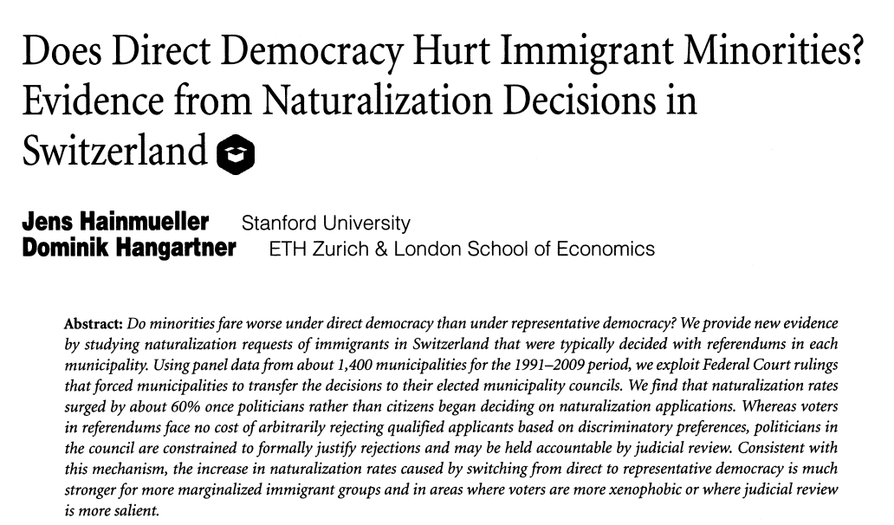

```{r setup, include=FALSE}
knitr::opts_chunk$set(echo = TRUE, eval=TRUE, warning=FALSE, message=FALSE)
```

# Today's plan

- DiD with staggered timing (continued): Sun & Abraham
- Synthetic control: `fect`


# Sun & Abraham

- Similar results to other papers, but special focus on event-studies

- Event-study regression:

$$
Y_{g,t} = \gamma_g + \lambda_t + \sum_{l=-K, l\neq-1}^{L} \hat{\beta}_{l} \mathbb{I} \{F_g = t-l\} + \varepsilon_{g,t}
$$

- For $l\geq 2$: $\hat{\beta}_l$ is the cumulative effect of $l+1$ treatment periods
- For $l\leq - 2$: $\hat{\beta}_l$ is a placebo coefficient (parallel trends test)


# Sun & Abraham

- Main result: the regression coefficient $\hat{\beta}_l$ can be decomposed in two weighted averages
  - Weighted average of group TEs at $l$, with possibly negative weights if the TEs vary across groups at $l$
  - Weighted average of group and period TEs for the other periods $l' \neq l$, non-zero if TEs vary across groups at $l'$
  
- "New" implication: the second weighted average contaminates also pre-treatment placebo coefficients

- Under TE heterogeneity, placebo coefficients cannot reliably inform about PT

# Sub & Abraham

- Solution: very close to Callaway & Sant'Anna

- Estimate the individual $ATT_{g,t}$ using "clean" controls (never-treated or last-treated)
  - With never-treated, S&A is equivalent to C&S
  - Estimator a bit less general than C&S
  
- Implemented in `fixest` through the `sunab` function


# Sun & Abraham

- Back to Daniele \& Geys (2015): the effect of local government dissolution on politicians' quality

\tiny
```{r}
library(tidyverse); library(haven); library(fixest)

dat <- read_dta("Organized Crime and Political Quality.dta")

dat <- mutate(dat, befcomgeneral_recode=(1-befcomgeneral)*mafiaben)

# Group variable
dat <- dat %>% group_by(desc_comune) %>% 
  mutate(group = case_when(mafiaben==1 ~ min(year[befcomgeneral_recode==1]),
                           mafiaben==0 ~ 0)) %>%
  ungroup()
```

# Sun & Abraham

\tiny
```{r}
# Indicator for time to treatment
dat <- dat %>% mutate(time_to_treatment = 
                        case_when(mafiaben==1 ~ (year-group),
                                  mafiaben==0 ~ -99))

# TWFE
fit_tw <- feols(MeanEduPol ~ i(time_to_treatment, ref=c(-1,-99)) | ID_municip + year, dat)

# Sun & Abraham
fit_sa <- feols(MeanEduPol ~ sunab(group, year) | ID_municip + year, dat) 
```

# Sun & Abraham
\tiny
```{r, fig.height=5, fig.align='center'}
iplot(list(fit_tw, fit_sa)); legend("bottomright", col = c(1,2), pch = c(20, 17), 
       legend = c("TWFE", "Sun & Abraham (2020)"))
```

# Synthetic control

- Last lecture: SC for causal inference with one treated unit

- Next lecture: SC for causal inference with multiple treated units
  - Can be used in cases with staggered (or not) adoption

- Today: preview + packages 


# Synthetic control

- Discussion based on Liu, Wang \& Xu (2022)

- Basic idea: use weighted averages of control observations to inpute the counterfactual trend among the treated
  - "Counterfactual estimators"
  
- Only use the control units at the modeling stage, so no "forbidden comparisons"

- Illustration with `fect` package (Liu, Wang \& Xu)
  - Implements 3 counterfactual estimators 
  
  - Implements placebo tests for pre-trends and other hypotheses


# Synthetic control

Application: Hainmueller \& Hangartner (2019)



# Synthetic control

\tiny
 
```{r}
# Data preparation
o.data <- read_dta("hh2015.dta")
dim <- nrow(o.data)
# Outcome variable
Y <- "nat_rate_ord"
# Treatment variable
D <- "indirect"
# Unit indicator
unit <- "bfs"
# Period indicator
period <- "year"
# Fixed effects level
FE <- c(unit, period)
# Cluster
cl <- unit
# Seed
seed <- 1453
# Clean from NAs
d <- o.data[complete.cases(o.data[,c(Y,D,FE)]), c(Y,D,FE)]
# Some more preparation
FEct.formula <- as.formula(paste0(Y, "~", D))
ylimit <- c(-3, 6)
elimit <- c(-0.4, 0.4)
nboots <- 1000

```


# Synthetic control
```{r, echo=F}
library(fect)
load("ex_HH2015.RData")
```

- Plot the treatment sequence with `panelView`

\tiny
```{r, eval=F}
library(panelView)

pv <- panelview(FEct.formula, 
                data = d, 
                index = c("bfs","year"), by.timing = TRUE, 
                axis.lab = "time", xlab = "Year", ylab = "Municipality", main = "", gridOff = TRUE,
                background= "white", legend.labs = c("Direct Democracy", "Indirect Democracy"))
```


# Synthetic control
\tiny
```{r, echo=F}
library(panelView)

pv <- panelview(FEct.formula, 
                data = d, 
                index = c("bfs","year"), by.timing = TRUE, 
                axis.lab = "time", xlab = "Year", ylab = "Municipality", main = "", gridOff = TRUE,
                background= "white", legend.labs = c("Direct Democracy", "Indirect Democracy"))
```


# Synthetic control

- FEct

$$
Y_{it}(0) = \mathbf{X}'_{it}\beta + \alpha_i + \xi_t + \varepsilon_{it}
$$

\tiny
```{r, eval=FALSE}
library(fect)
out.fect.p <- fect(formula = as.formula(FEct.formula), 
                   data = d, method = "fe",
                   index=FE, tol = 1e-5, se = 1, nboots = nboots, r = 0,
                   CV = FALSE, force = "two-way", parallel = 1,
                   placeboTest = 1, placebo.period = c(-2, 0))

```


# Synthetic control

- IFEct

$$
Y_{it}(0) = \mathbf{X}'_{it} \beta + \alpha_i + \xi_t + \lambda'_if_t + \varepsilon_{it}
$$

\tiny
```{r, eval=FALSE}
out.fect <- fect(formula = as.formula(FEct.formula), 
                 data = d, method = "ife",
                 index=FE, tol = 1e-5, se = 1, nboots = nboots, loo = 1,
                 r = 0, CV = FALSE, force = "two-way", parallel = 1)

```


# Synthetic control

- Matrix completion

$$
\mathbf{Y}(\mathbf{0}) = \mathbf{X}\beta + \mathbf{L} + \mathbf{\varepsilon}
$$

\tiny
```{r, eval=FALSE}
out.mc <- fect(as.formula(FEct.formula), 
               data = d, method = "mc", 
               index=FE, tol = 1e-3, se = TRUE, nboots = nboots,
               cv.prop = 0.1, cv.nobs = 3, cv.treat = 1, loo = 0,
               CV = TRUE, force = "two-way", parallel = 1)
```


# Synthetic control

- Plot the estimated effects 

\tiny
```{r}
xlab <- "Time Since the Treatment Started"
d_ylim <- c(-4, 4)

p.gap <- plot(out.fect, type = "gap", 
              ylab = "Effect of Indirect Democracy on Naturalization Rate (%)", ylim = d_ylim,
              xlim = c(-14,5), main = "", theme.bw = TRUE, xlab = xlab,
              p.value = TRUE, text.pos = c(-14.5,3))
```


# Synthetic control

\tiny
```{r, echo=F, fig.height=5, fig.align='center'}
p.gap
```


# Synthetic controls

- Plot placebo test

\tiny
```{r}
p.placebo <- plot(out.fect.p, type = "gap", 
                  ylab = "Effect of Indirect Democracy on Naturalization Rate (%)", 
                  placeboTest = 1, placebo.period = c(-1, 0), xlab = xlab,
                  stats.labs = c("t test p-value","TOST p-value"), xlim = c(-14,5), ylim = d_ylim,  
                  label.pos = c(-12.5, 3.8), 
                  main = "", theme.bw = TRUE, show.stats = TRUE, 
                  stats = c("placebo.p","equiv.p"))

```


# Synthetic control

```{r, echo=F, fig.align='center', fig.height=5}
p.placebo
```

# Synthetic control

- Plot equivalence test for pre-trends

\tiny
```{r}
p.equiv <- plot(out.fect, type = "equiv", 
                ylab = "Average Prediction Error", ylim = d_ylim, xlim = c(-14,0), 
                main = "", theme.bw = TRUE, xlab = xlab,
                stats.labs = c("F test p-value","TOST max p-value"), legendOff = TRUE, loo = 1) 
```

# Synthetic control
\tiny

```{r, echo=F, fig.height=5, fig.align='center'}
p.equiv
```