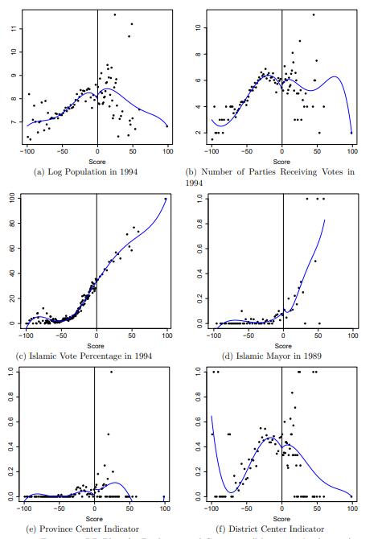

```{r setup, include=FALSE}
knitr::opts_chunk$set(echo = TRUE, eval=TRUE, warning=FALSE, message=FALSE)
```

# Today's plan

- RDD implementation: local regression approach

- Material from [Cattaneo, Idrobo, and Titiunik (2020)](https://mdcattaneo.github.io/books/Cattaneo-Idrobo-Titiunik_2020_CUP.pdf)

- packages: `rdrobust`, `rddensity`, `rdlocrand` (available in both Stata and R format)

- Next week
  - Extensions: fuzzy RDD, local randomization approach
  - Topics in RDD: GRDD, Diff-in-disc etc


# Working example: Meyersson (2014)
{width=75%}


# Meyersson (2014)

Causal effects of interest: 

- Victory of Islamic candidate on educational attainment of women

Elements:

> - **Outcome (Y)**: percentage of women aged 15-20 in 2000 who had completed high school by 2000

> - **Running variable (X)**: vote percentage of the Islamic party minus vote percentage of the strongest secular opponent

> - **Treatment (T)**: 1 if Islamic party won in 1994, 0 otherwise

# Set-up

\tiny
```{r}
library(rdrobust); library(rddensity); library(haven)

# Import data and define variables
data <- read_dta("CIT_2019_Cambridge_polecon.dta")

Y <- data$Y
X <- data$X
T <- data$T
T_X <- T*X

```


# Visualization
\pause
\tiny
```{r, fig.align='center', out.width = "75%"}
# Before we begin:
# ?rdplot

# Raw means comparison
rdplot(Y, X, nbins = c(2500, 500), p = 0, col.lines = "red", col.dots = "black", title = "", 
       x.label = "Islamic Margin of Victory", y.label = "Female High School Percentage", y.lim = c(0,70))
```


# Visualization
\tiny
```{r, fig.align='center', out.width = "75%"}
# Local means comparison
rdplot(Y[abs(X) <= 50], X[abs(X) <= 50], nbins = c(2500, 500), p = 4, col.lines = "red", col.dots = "black", 
       title = "", x.label = "Islamic Margin of Victory", y.label = "Female High School Percentage", 
       y.lim = c(0,70))
```


# Binning

> - It may be hard to spot visually discontinuities in raw data

> - Common approach: binning to "smooth" the data

> - Split the raw data into segments (bins) of the running variable, compute the mean outcome in each bin

> - Plot the mean outcome against the mid point of the bin

> - Overlay global polynomial fit of the outcome on the running variable, estimated **separately** on each side of the cutoff and using the **raw data**

> - `rdrobust::rdplot` does it automatically

# Binning
Set bin size manually: evenly-spaced.
\tiny
```{r, fig.align='center', out.width = "75%"}
# Default is 4th polynomial degree on each side
rdplot(Y, X, nbins = c(20,20), binselect = "es", y.lim = c(0,25))
```

# Principled binning

Quantile-spaced bins: retain information about actual data distribution, reduce discretion

\tiny
```{r, fig.align='center', out.width = "75%"}
rdplot(Y, X, nbins = c(20,20), binselect = 'qs', x.label = 'Score', 
       y.label = 'Outcome', title = '', x.lim = c(-100,100), y.lim = c(0,25))
```


# Principled binning

Data-driven approach: minimize IMSE of local means estimator (optimize along bias-variance)

\tiny
```{r, fig.align='center', out.width = "75%"}
rdplot(Y, X, binselect = 'qs', x.label = 'Score', 
       y.label = 'Outcome', title = '', x.lim = c(-100,100), y.lim = c(0,25))
```

# Principled binning

Mimicking variance: choose number of bins so that the variability of means "mimicks" that of the raw data.

\tiny
```{r, fig.align='center', out.width = "75%"}
rdplot(Y, X, binselect = 'qsmv', x.label = 'Score', 
       y.label = 'Outcome', title = '', x.lim = c(-100,100), y.lim = c(0,25))
```


# Binning in sum
"Which method of implementation is most appropriate depends on the researcher's particular goal, for example, illustrating/testing for the overall functional form versus showing the variability of the data. We recommend to start with MV bins to better illustrate the variability of the outcome as a function of the score, ideally comparing ES and QS bins to highlight the distributional features of the score. Then, if needed, the researcher can select the number of bins to be IMSE-optimal in order to explore the global features of the regression function." (Cattaneo, Idrobo, and Titiunik 2020)

# Estimation of causal effects
**Continuity-based framework**

> - If CEF functions are continuous at cutoff, RDD identifies a causal effect at cutoff

> - In practice, observations never have the cutoff value

> - Approximate CEF on both sides of cutoff

> - Global approximations: good for plots (descriptions), not suitable for causal effect estimation: [Gelman and Imbens (2019)](https://www.tandfonline.com/doi/pdf/10.1080/07350015.2017.1366909)

> - Best current practice: local polynomial functions with low order near cutoff

# Estimation of causal effects

Sharp RDD:

> - Choose polynomial of order $p$ and a kernel function $K(.)$
> - Choose a bandwidth $h$ around the cutoff $c$
> - Estimate on each side of the cutoff a WLS regression with weights $K(\frac{X_i-c}{h})$: \pause

$$
\begin{aligned}
{\color{red} \hat{Y}_i = \hat{\mu}_+ + \hat{\mu}_{+,1}(X_i -c) + \hat{\mu}_{+,2}(X_i -c)^2 + ... + \hat{\mu}_{+,p}(X_i -c)^p} \\
{\color{blue} \hat{Y}_i = \hat{\mu}_- + \hat{\mu}_{-,1}(X_i -c) + \hat{\mu}_{-,2}(X_i -c)^2 + ... + \hat{\mu}_{-,p}(X_i -c)^p} 
\end{aligned}
$$

> - Calculate the sharp RD estimate: $\hat{\tau}_{SRD} = {\color{red} \hat{\mu}_+} - {\color{blue} \hat{\mu}_-}$, the difference of the two functions when $X_i = c$

# Estimation of causal effects


# Parameters
Relevant parameters

> - **Kernel**: triangular one is recommended (weight = 0 outside $h$ and $\uparrow$ as we get closer to $c$) and default in `rdrobust`. Alternatives: Uniform and Epanechnikov 

> - **Bandwidth**: the most important thing. Usually chosen by a data-driven approach to minimize the MSE of the local polynomial point estimator

>   - `rdrobust:rdbwselect` selects a variety of optimal bandwidths. Either stand-alone or called from inside `rdrobust` using the option `bwselect`

> - **Polynomial order**: low to avoid overfitting, generally local linear is the default choice

# Estimation
\tiny
```{r}
# By default c = 0
out <- rdrobust(Y, X, kernel = "uniform", p = 1, h = 20)
summary(out)
```


# Estimation
\tiny
```{r}
# Choose h to minimize MSE
out <- rdrobust(Y, X, kernel = "triangular", p = 1, bwselect = "mserd")
summary(out)
```


# Illustrate the main effect
\tiny
```{r, fig.align='center', out.width = "75%"}
bw <- out$bws[1,1]
rdplot(Y[abs(X)<=bw], X[abs(X)<=bw], p = 1, kernel = 'triangular', 
       x.label = 'Score', y.label = 'Outcome', title = '', y.lim = c(10,22))
```


# Inference

> - Local polynomial function may be biased

> - Take into account the bias when making inference

> - One can:

>   - Estimate the bias and remove it from the derivation of confidence interval

>   - Incorporate extra variability from bias removal in the SE estimate

# Inference


# Inference

> - Robust bias correction enables to do valid inference using the same bandwidth used for the point estimate

> - Another approach: use a different bandwidth for SE calculation


# Inference
\tiny
```{r}
out <- rdrobust(Y, X, kernel = 'triangular',  p = 1, bwselect = 'mserd', all = TRUE)
summary(out)
```


# RDD assumption violations

> - Key ID assumption: potential outcomes continuous at the cutoff

$$\lim_{x \to c^+} E[Y_i(j)|X=x] = \lim_{x \to c^-} E[Y_i(j)|X=x] = E[Y_i(j)|X=c], j \in (0,1)$$


> - There are instances where this assumption can be plausibly violated.

# RDD assumption violations

**Sorting**: units try to get just above/below the cutoff \pause 

> - In our example: Islamic parties may invest more in winning election in some important municipalities

> - If they are successful, just-won towns would be different from just-lost ones, i.e. a discontinuity at the cutoff

> - Check for discontinuities in observable variables that we would expect to be continuous: typically pre-treatment covariates

> - Placebos


# RDD with placebo outcomes

\tiny
```{r, echo=FALSE}
library(haven); library(rdrobust)

# Import data and define variables
data <- read_dta("CIT_2019_Cambridge_polecon.dta")

Y <- data$Y
X <- data$X
T <- data$T
T_X <- T*X
```


{height=75%}


# RDD with placebo outcomes
\tiny
```{r, out.width="80%"}
bw <- rdrobust(data$partycount, X)$bws[1, 1]
xlim <- ceiling(bw)
rdplot(data$partycount[abs(X) <= bw], X[abs(X) <= bw],
       p = 1, kernel = "triangular", x.lim = c(-xlim, xlim), x.label = "Islamic vote margin", y.label = "", title = "")
```


# Density tests

> - Check for evidence of sorting by looking at the distribution of the running variable

> - Formal tests: estimate density of RV on the two sides with local polynomial density estimator

> - Test the null that the density is the same on the two sides

> - Classic test: [McCrary (2008)](https://www.sciencedirect.com/science/article/pii/S0304407607001133)
>   - Stata: user-written `DCdensity` ([here](https://eml.berkeley.edu/~jmccrary/DCdensity/))
>   - R: `DCdensity` in the package `rdd` 

> - Another test: [Cattaneo, Jansson and Ma (2020)](https://www.tandfonline.com/doi/full/10.1080/01621459.2019.1635480)
>   - Stata and R:`rddensity` 

# Density tests
\tiny
```{r}
library(rddensity)

out <- rddensity(X)
summary(out)

```


# Density tests
\tiny
```{r}
library(lpdensity)

bw_left <- as.numeric(rddensity(X)$h[1])
bw_right <- as.numeric(rddensity(X)$h[2])

est1 <- lpdensity(data = X[X < 0 & X >= -bw_left], grid = seq(-bw_left, 0,
                                                              0.1), 
                  bwselect = "IMSE", scale = sum(X < 0 & X >= -bw_left) / length(X))

est2 <- lpdensity(data = X[X >= 0 & X <= bw_right], grid = seq(0, bw_right,
                                                               0.1), 
                  bwselect = "IMSE", scale = sum(X >= 0 & X <= bw_right) / length(X))

```

# Density tests
\tiny
```{r, out.width="80%"}
library(ggplot2)
plot1 <- lpdensity.plot(est1, est2, CIshade = 0.2, lcol = c(4, 2), CIcol = c(4, 2), legendGroups = c("Control", "Treatment")) + 
  labs(x = "Score", y = "Density") + geom_vline(xintercept = 0, color = "black") +
  theme_bw(base_size = 17)+theme(legend.position = c(0.8, 0.85))
plot1
```


# RDD with placebo cutoffs

> - So far, placebo outcomes: replace the outcome with one that should not be affected by treatment
>   - If it is affected, evidence of confounding
>   - Other examples: Balance tests in experiments

> - Now placebo treatments: replace the treatment with one that by construction has no effect but the same confounding source
>   - If there is effect, evidence of confounding also in the original treatment
>   - Other examples: "Pre-trend" coefficients in DiD are an example

> - In RDD: vary the cutoff where there should be no discontinuities


# RDD with placebo cutoffs
\tiny
```{r}
placebo <- function(Y, X, new_cutoff){
  if (new_cutoff > 0){
    Y <- Y[X>=0]; X <- X[X>=0]
  }
  if (new_cutoff < 0){
    Y <- Y[X<0]; X <- X[X<0]
  }
  else{
    Y <- Y; X <- X
  }

  out <- rdrobust(Y, X, c = new_cutoff)
  coef <- out$coef["Conventional",]
  ll <- out$ci["Robust",1]
  ul <- out$ci["Robust",2]
  
  cbind(coef, ll, ul)
}

cutoffs <- as.list(c(-3:3))
(placebos <- do.call("rbind", lapply(cutoffs, function(i) placebo(Y, X, i))))
```

# RDD with placebo cutoffs
\tiny
```{r, fig.align="center", out.width="75%"}
library(dplyr)
placebos %>% as.data.frame() %>% mutate(cutoff = -3:3) %>% 
  ggplot(aes(x=cutoff, y=coef)) + geom_point(col="red") +
  geom_errorbar(aes(ymin=ll, ymax=ul), col="blue",width=0.1) + 
  labs(y = "RD Treatment Effect", x = "Cutoff (x=0 true cutoff)") +
  geom_hline(yintercept=0, col="black", linetype = "dashed") + theme_bw()
```


# Sensitivity checks
Other possible sensitivity analyses to check for stability of results:

> - Exclude points closer to the cutoff

> - Vary the bandwidth in a neighborhood of the optimal bandwidth

# Summing up

The standard practice includes:

- Graphical and formal placebo tests with covariates and other outcomes

- Density tests for sorting around the cutoff

- Perturbate the cutoff values

- Exclude observations near the cutoff

- Vary the bandwidth choice

# Covariates

> - Can we add covariates to RDD estimation?

> - [Calonico, Cattaneo, Farrell, and Titiunik (2019)](https://cattaneo.princeton.edu/papers/Calonico-Cattaneo-Farrell-Titiunik_2019_RESTAT.pdf) study properties of RDD estimators with covariate adjustment

> - There can be an efficiency argument in favor of covariate adjustment ($\sim$ randomized experiments)

> - In applications, often people include group fixed effects or unbalanced covariates

> - CCFT recommend not to interact covariates with treatment indicator (allowing for different effects on the two sides requires stronger assumptions)

> - In `rdrobust`: use the  `covs` argument
